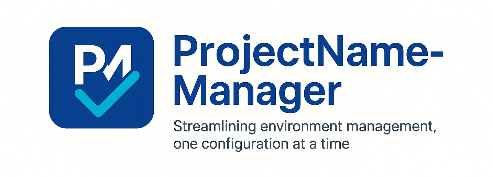
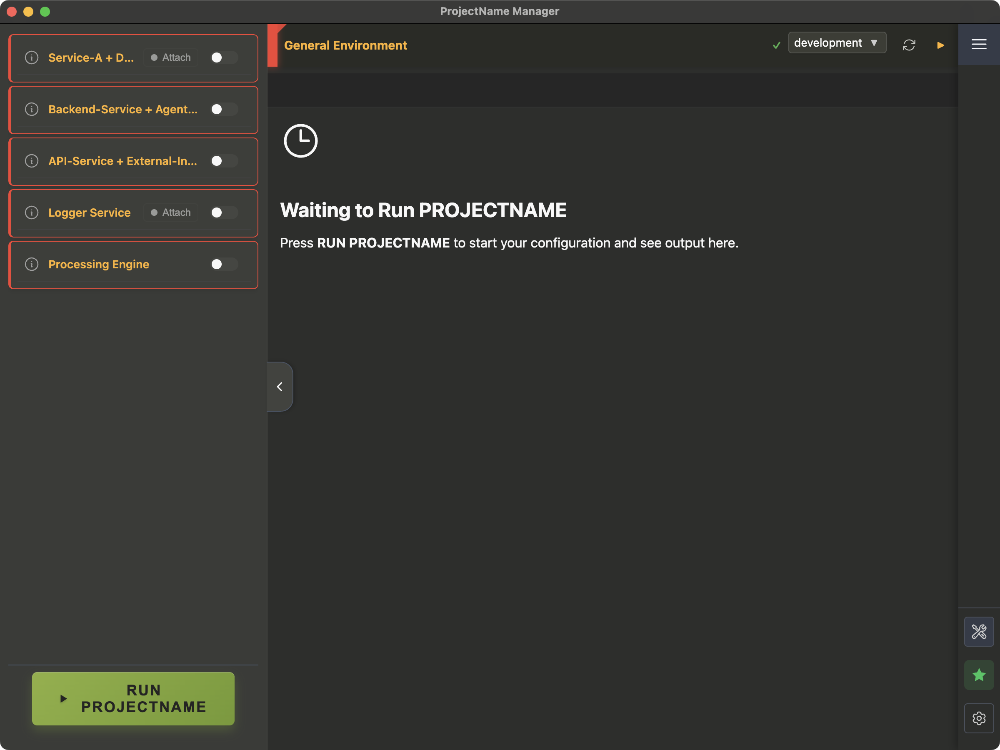
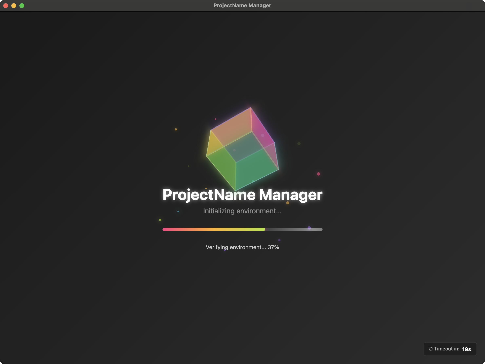

<div align="center">
  
</div>

<div align="center">
  
[](https://opensource.org/licenses/MIT)
[](https://electronjs.org/)
[](https://reactjs.org/)
[](https://nodejs.org/)
[](https://github.com/electron/electron)

</div>

**Born from the frustration of juggling complex development setups, {ProjectName} Manager** provides a single interface for environment verification, terminal management, and JSON-based configuration.

**🚀 Why developers love it:**
- **Set Once, Use Everywhere** – JSON configs remove setup repetition
- **Catch Issues Early** – verification prevents deployment headaches
- **Terminal Mastery** – integrated terminals with advanced tab management
- **Safety Net** – preview and read-only modes guard against mistakes

<div align="center">
  
  <p><em>Main interface showing project configuration with integrated terminals</em></p>
</div>

This project is also an experiment in "vibe coding" mixed with good old coding. I explored a variety of AI tools and language models to see how they complement traditional development. Details can be found in the [AI Coding Experiment](docs/development/ai-experiments.md) document.

## 🚀 Quick Start

```bash
# Clone the repository
git clone https://github.com/sagy101/ProjectName-Manager.git
cd ProjectName-Manager

# Install dependencies
npm install

# Rebuild native modules for Electron
npm run rebuild

# Start the application
npm start
```

For development mode with file watching:
```bash
npm run watch  # In one terminal
npm start      # In another terminal
```

## 📋 Core Features

### Environment Management
- **Dynamic Environment Verification** with JSON-configurable checks
- **Auto-Fix Commands** for one-click remediation
- **Auto Setup** for automated environment configuration
- **Generic Dropdown Selectors** with dependency chains

<div align="center">
  
  <p><em>Loading screen with environment verification progress</em></p>
</div>

### Terminal System  
- **Integrated Terminal** with full PTY support and tab management
- **Floating Terminals** for auxiliary tasks and log viewing
- **Read-Only Safety** with debug override options
- **Container Lifecycle Management** tied to terminal tabs

### Configuration & UI
- **Modular JSON Configuration** - customize without code changes
- **Git Integration** for branch management
- **Real-time Status Updates** and health monitoring
- **No Run Mode** for safe command preview
- **Test Section Management** for development workflows

## 📚 Documentation

For complete documentation, see the **[Documentation Guides](docs/README.md)**.

### 🚀 Quick Start Guides
- [Getting Started & Installation](docs/getting-started.md) - Detailed setup instructions

### 🏗️ Architecture & Development
- [Architecture Overview](docs/architecture/overview.md) - System design and components
- [Main Process Architecture](docs/architecture/main-process.md) - Backend modules
- [Renderer Process Architecture](docs/architecture/renderer.md) - Frontend React architecture
- [Communication Flow](docs/architecture/communication.md) - IPC system

### ⚙️ Configuration System
- [Configuration Overview](docs/configuration/overview.md) - Basic concepts and principles
- [Section Configuration](docs/configuration/sections.md) - UI components and structure
- [Command Configuration](docs/configuration/commands.md) - Command generation logic
- [Dropdown Configuration](docs/configuration/dropdowns.md) - Dynamic dropdown selectors
- [Configuration Examples](docs/configuration/examples.md) - Complete working examples

### 🎯 Feature Guides
- [Auto Setup System](docs/features/auto-setup.md) - Automated environment configuration
- [Terminal System](docs/features/terminal-system.md) - Integrated terminal features
- [Health Report](docs/features/health-report.md) - Service monitoring
- [Environment Verification](docs/features/verification.md) - Verification types

### 🛠️ Development Resources
- [Testing Guide](docs/development/testing.md) - Test infrastructure and practices
- [Export & Import Tools](docs/development/export-import.md) - Configuration backup
- [AI Experiments](docs/development/ai-experiments.md) - Development methodology
- [Development Roadmap](docs/roadmap.md) - Future enhancements and feature timeline

## ⚙️ Configuration Overview

{ProjectName} Manager uses a modular JSON-based configuration system:

| File | Purpose | Guide |
|------|---------|-------|
| `configurationSidebarSections.json` | UI structure and components | [Sections Guide](docs/configuration/sections.md) |
| `configurationSidebarCommands.json` | Command generation logic | [Commands Guide](docs/configuration/commands.md) |
| `configurationSidebarAbout.json` | Section descriptions and verifications | [Configuration Overview](docs/configuration/overview.md) |
| `generalEnvironmentVerifications.json` | System-wide environment checks | [Verification Guide](docs/features/verification.md) |

See the [Configuration Overview](docs/configuration/overview.md) for detailed information.

## 🔧 Adding New Sections

Adding new functionality requires updating three JSON files - no code changes needed:

1. **Define UI** in `configurationSidebarSections.json`
2. **Add Descriptions** in `configurationSidebarAbout.json`  
3. **Configure Commands** in `configurationSidebarCommands.json`

See [Configuration Examples](docs/configuration/examples.md) for step-by-step examples.

## 🛠️ Development

### Requirements
- Node.js 22.16.0 (for the Electron app)
- npm or yarn
- Git

### Build & Run
```bash
npm run build    # Development build
npm run watch    # Build with file watching
npm start        # Start the application
npm test         # Run all tests
```

### Native Module Rebuilding
After installing new native dependencies:
```bash
npm run rebuild
```

### Project Structure
```
ProjectName-Manager/
├── src/
│   ├── main-process/          # Electron main process modules
│   ├── common/                # Shared components and hooks
│   ├── project-config/        # Configuration UI and logic
│   ├── environment-verification/ # Verification system
│   ├── terminal/              # Terminal components
│   ├── floating-terminal/     # Floating terminal system
│   ├── auto-setup/            # Auto-setup feature
│   ├── health-report/         # Health monitoring
│   └── ...                    # Other feature modules
├── __tests__/                 # Test suites
├── docs/                      # Documentation
└── main.js                    # Entry point
```

## 📄 License

This project is licensed under the [MIT License](LICENSE).

## 🙏 Acknowledgments

- Built with [Electron](https://electronjs.org/)
- UI powered by [React](https://reactjs.org/)
- Terminal integration via [node-pty](https://github.com/microsoft/node-pty)
- Icons from [Heroicons](https://heroicons.com/)

---

<div align="center">
  <strong>{ProjectName} Manager</strong> - Streamlining environment management, one configuration at a time.
</div>
