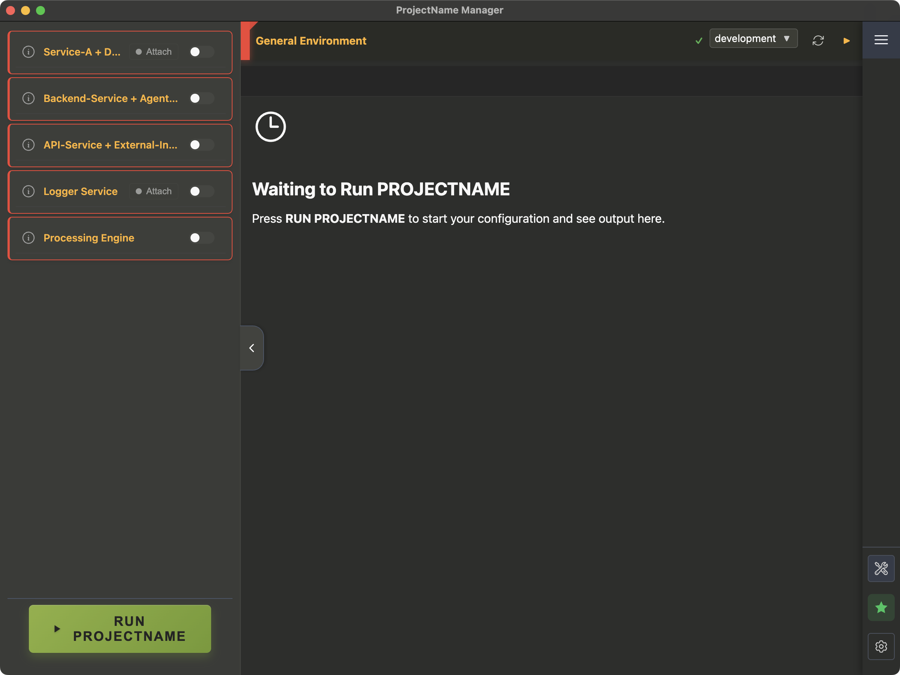

# {ProjectName} Manager Documentation

> Complete documentation for {ProjectName} Manager - a powerful, modular desktop application for managing project environments.

  
  
<em>ProjectName Manager main interface with integrated development environment</em>

## 📖 Documentation Structure

This documentation is organized into focused guides for different audiences and use cases.

## 🚀 Getting Started

**New to {ProjectName} Manager?** Start here:

- **[Getting Started Guide](getting-started.md)** - Installation, setup, and first run
- **[Configuration Overview](configuration/overview.md)** - Understanding the JSON configuration system
- **[Architecture Overview](architecture/overview.md)** - How everything works together

## 📚 Documentation Guides

### 🏗️ [Architecture Guides](architecture/)
**Understanding the system design and technical implementation**

- [Overview](architecture/overview.md) - High-level system design and concepts
- [Main Process](architecture/main-process.md) - Backend modules and services (Node.js)
- [Renderer Process](architecture/renderer.md) - Frontend React architecture
- [Communication](architecture/communication.md) - IPC system and data flow
- [Performance](architecture/performance.md) - Caching and optimization strategies

### ⚙️ [Configuration Guides](configuration/)
**Master the JSON-based configuration system**

- [Overview](configuration/overview.md) - Basic concepts and quick start
- [Sections](configuration/sections.md) - UI components and structure
- [Commands](configuration/commands.md) - Command generation and execution
- [Dropdowns](configuration/dropdowns.md) - Dynamic dropdown selectors
- [Examples](configuration/examples.md) - Complete working examples

### 🎯 [Feature Guides](features/)
**Detailed guides for major application features**

| Feature | Description | Screenshot |
|---------|-------------|------------|
| [Auto Setup](features/auto-setup.md) | Automated environment configuration |  |
| [Terminal System](features/terminal-system.md) | Integrated terminal features |  |
| [Health Report](features/health-report.md) | Service monitoring and health checks |  |
| [Environment Verification](features/verification.md) | Verification types and configuration |  |

#### 🛠️ [Development Guides](development/)
**Resources for developers and contributors**

- [**Contributing Guide**](CONTRIBUTIONS.md) - **Project branch strategy and contribution guidelines**
- [Testing Guide](development/testing.md) - Test infrastructure and practices
- [Export & Import](development/export-import.md) - Configuration backup tools
- [AI Experiments](development/ai-experiments.md) - Development methodology

### 🗺️ [Project Roadmap](roadmap.md)
**Future development plans and feature roadmap**

- [Development Roadmap](roadmap.md) - Planned enhancements and feature timeline

## 🗺️ Quick Navigation Guide

### "I want to..."

| I want to... | Go to... |
|---------------|----------|
| **Set up the application** | [Getting Started Guide](getting-started.md) |
| **Add a new service/section** | [Configuration Examples](configuration/examples.md) |
| **Understand how to configure the app** | [Configuration Overview](configuration/overview.md) |
| **Fix environment issues automatically** | [Auto Setup Guide](features/auto-setup.md) |
| **Learn about terminal capabilities** | [Terminal System Guide](features/terminal-system.md) |
| **Understand the codebase structure** | [Architecture Overview](architecture/overview.md) |
| **Run tests or contribute code** | [Testing Guide](development/testing.md) |
| **Contribute to the project or create custom project branches** | [Contributing Guide](CONTRIBUTIONS.md) |
| **Monitor running services** | [Health Report Guide](features/health-report.md) |
| **Configure dynamic dropdowns** | [Dropdown Configuration](configuration/dropdowns.md) |
| **Export/import configuration** | [Export & Import Guide](development/export-import.md) |
| **See future development plans** | [Development Roadmap](roadmap.md) |

## 🔍 Quick Reference

### Configuration Files
| File | Purpose | Guide |
|------|---------|-------|
| `configurationSidebarSections.json` | UI structure and components | [Sections](configuration/sections.md) |
| `configurationSidebarCommands.json` | Command generation logic | [Commands](configuration/commands.md) |
| `configurationSidebarAbout.json` | Section descriptions and verifications | [Overview](configuration/overview.md) |
| `generalEnvironmentVerifications.json` | System-wide environment checks | [Verification](features/verification.md) |

### Core Features
| Feature | Description | Guide |
|---------|-------------|-------|
| **Auto Setup** | One-click environment configuration | [Auto Setup Guide](features/auto-setup.md) |
| **Terminals** | Integrated terminal with PTY support | [Terminal Guide](features/terminal-system.md) |
| **Verification** | Environment checking and validation | [Verification Guide](features/verification.md) |
| **Health Report** | Service monitoring and status | [Health Report Guide](features/health-report.md) |

## 🔑 Key Concepts

- **Sections**: Logical groupings of functionality (services, projects)
- **Verifications**: Checks for tools, paths, and environment setup
- **Commands**: Dynamically generated based on configuration state
- **Fix Commands**: One-click remediation for failed verifications
- **Floating Terminals**: Auxiliary terminal windows for specific tasks
- **Health Report**: Centralized monitoring of all services

## 💡 Tips

- All functionality is JSON-configured - no code changes needed for customization
- Use Auto Setup for quick environment configuration
- Check verification failures before running services
- Main terminals are read-only by default for safety
- The Health Report provides the best overview of running services

## 📋 Documentation Principles

This documentation follows these principles:

### **Task-Oriented**
- Organized by what users want to accomplish
- Step-by-step guides with clear outcomes
- Real-world examples and use cases

### **Progressive Disclosure**
- Quick start for immediate needs
- Deep dives for comprehensive understanding
- Cross-references to related topics

### **Code-Validated**
- All examples tested against actual codebase
- Configuration snippets that actually work
- Up-to-date with current implementation

### **Multiple Audiences**
- **End Users**: Configuration and feature guides
- **Developers**: Architecture and development guides
- **Contributors**: Testing and development methodology

## 🔗 External Resources

- **[GitHub Repository](https://github.com/sagy101/ProjectName-Manager)** - Source code and issues
- **[Electron Documentation](https://electronjs.org/docs)** - Electron framework
- **[React Documentation](https://reactjs.org/docs)** - React frontend library
- **[Node.js Documentation](https://nodejs.org/docs)** - Node.js runtime

---

  <strong>Need help?</strong> Start with the <a href="getting-started.md">Getting Started Guide</a> or browse the guides above.

 