# System Architecture - Detailed Documentation

This document provides comprehensive technical details of {ProjectName} Manager's architecture. For a high-level overview, see the [Architecture Overview](architecture-overview.md).

## Table of Contents

- [Implementation Details](#implementation-details)
- [Architecture Diagram](#architecture-diagram)
- [Main Process Modular Architecture](#main-process-modular-architecture)
- [Communication Flow](#communication-flow)
- [Environment Verification System](#environment-verification-system)
- [Auto Setup System](#auto-setup-system)
- [Terminal System Architecture](#terminal-system-architecture)
- [Command Generation & Execution](#command-generation--execution)
- [Configuration System](#configuration-system)
- [Caching & Performance](#caching--performance)
- [Safety & Debug Features](#safety--debug-features)
- [Data Flow Summary](#data-flow-summary)
- [Development Environment](#development-environment)
- [Performance Characteristics](#performance-characteristics)
- [Related Documentation](#related-documentation)

## Implementation Details

This document dives into the technical implementation of {ProjectName} Manager's architecture. The system is built on Electron with a React frontend and Node.js backend, following modular design principles throughout.

## Architecture Diagram


## Main Process Modular Architecture

The main process has been refactored into a modular architecture for better maintainability, testing, and separation of concerns. Each module, located in `src/main-process/`, handles a specific domain of functionality:

### Core Modules

<details>
<summary>Click to expand detailed module descriptions</summary>

#### `main.js` - Orchestration Layer
- **Purpose**: Application lifecycle management and IPC handler registration
- **Responsibilities**: Window creation, IPC routing, startup coordination, modular IPC handler setup
- **Dependencies**: All other modules as imports
- **Modular Architecture**: Delegates IPC handler setup to specialized modules (e.g., `dropdownManagement.setupDropdownIpcHandlers()`)

#### `environmentVerification.js` - Environment Management
- **Purpose**: System environment checking and verification
- **Responsibilities**: Tool validation, path checking, environment variables, caching, command output capture
- **Key Functions**: `verifyEnvironment()`, `refreshEnvironmentVerification()`, `getEnvironmentVerification()`, `getEnvironmentExportData()`
- **Export Feature**: Captures and exports all verification command outputs with status for debugging

#### `ptyManagement.js` - Terminal Process Management
- **Purpose**: PTY (pseudo-terminal) process lifecycle management with advanced monitoring
- **Responsibilities**: Process spawning, I/O handling, cleanup, tracking, real-time status detection, control character monitoring
- **Key Functions**: `spawnPTY()`, `killProcess()`, `writeToPTY()`, `resizePTY()`, `startProcessMonitoring()`, `getChildProcesses()`, `interpretProcessState()`
- **Monitoring Features**: Process tree discovery, state interpretation, control character detection, exit code capture

#### `containerManagement.js` - Docker Operations
- **Purpose**: Docker container lifecycle management
- **Responsibilities**: Container status checking, stopping, event emission
- **Key Functions**: `getContainerStatus()`, `stopContainers()`, container status monitoring

#### `gitManagement.js` - Git Repository Operations
- **Purpose**: Git branch management and repository operations
- **Responsibilities**: Branch switching, listing, caching, path resolution
- **Key Functions**: `checkoutGitBranch()`, `listLocalGitBranches()`, `getGitBranch()`, cache management

#### `dropdownManagement.js` - Command Execution & Parsing
- **Purpose**: Dynamic dropdown population, command parsing, and change command execution
- **Responsibilities**: Command execution, response parsing, caching, dependency handling, IPC handler setup, change command execution
- **Key Functions**: `getDropdownOptions()`, `executeDropdownChangeCommand()`, `setupDropdownIpcHandlers()`, cache management
- **New Features**: Automatic command execution on dropdown value changes with variable substitution

#### `configurationManagement.js` - Configuration Management
- **Purpose**: Application configuration loading, import/export
- **Responsibilities**: File I/O, JSON parsing, dialog handling, settings management
- **Key Functions**: `loadAppSettings()`, `importConfiguration()`, `exportConfiguration()`, `getAboutConfig()`

#### `windowManagement.js` - Window Management
- **Purpose**: Electron window creation and management
- **Responsibilities**: Window options, DevTools handling, display settings integration
- **Key Functions**: `createWindow()`, window lifecycle management

</details>

### Benefits of Modular Architecture

- **Separation of Concerns**: Each module has a single, well-defined responsibility
- **Testability**: Individual modules can be tested in isolation with proper mocking
- **Maintainability**: Easier to locate and modify specific functionality
- **Reusability**: Modules can be imported and used across different parts of the application
- **Error Isolation**: Issues in one module don't cascade to others
- **Performance**: Lazy loading and efficient resource management per module

### Renderer Process Component Architecture

The renderer process is built with React and follows a modern, modular architecture centered around components and custom hooks. This mirrors the modularity of the main process, ensuring the codebase is scalable and maintainable.

#### Component Hierarchy
-   **Container Components**: High-level components like `ProjectConfiguration` and `TerminalContainer` manage state and orchestrate their children.
-   **Presentational Components**: Smaller, reusable components like `RunButton`, `TerminalPlaceholder`, and `ConfigSection` focus on rendering specific pieces of the UI.
-   **Custom Hooks**: Complex, reusable stateful logic is extracted into custom hooks for better organization and testability.

#### App Component Architecture

The main `App.jsx` component follows a clean, modular architecture using custom hooks:


#### Custom Hooks Architecture

| Hook | Purpose | Key Responsibilities | Location |
|------|---------|---------------------|-----------|
| `useAppState` | State Management | All useState hooks, refs, initialization functions | `src/common/hooks/` |
| `useAppEffects` | Side Effects | useEffect hooks, event listeners, loading process, git refresh | `src/common/hooks/` |
| `useAppEventHandlers` | Event Handling | User interactions, callbacks, notifications, toggle functions | `src/common/hooks/` |
| `useFloatingTerminals` | Terminal Management | Floating terminal lifecycle, positioning, info panels | `src/floating-terminal/` |
| `useConfigurationManagement` | Configuration | Import/export, git operations, status screens | `src/project-config/hooks/` |
| `useFixCommands` | Fix Commands | Fix command execution, verification updates, toggle verifications | `src/project-config/hooks/` |
| `useAutoSetup` | Auto Setup | Priority-based command execution, progress tracking, smart terminal management | `src/auto-setup/` |

> **Note**: These hooks are feature-specific and located within their respective module directories, reflecting the modular architecture. The App component imports and orchestrates them, but each hook is maintained within its related feature domain.

#### Benefits of the Modular Architecture

- **Separation of Concerns**: Each hook has a single, well-defined responsibility
- **Testability**: Individual hooks can be tested in isolation with proper mocking
- **Maintainability**: Easier to locate and modify specific functionality
- **Reusability**: Hooks can be imported and used across different components
- **Readability**: Main App component is clean and focused on composition
- **Performance**: Better dependency management and reduced re-renders

#### File Structure

<details>
<summary>Click to expand complete file structure</summary>

```
src/
├── App.jsx
├── main-process/             # Main process modules
│   ├── configurationManagement.js
│   ├── containerManagement.js
│   ├── dropdownManagement.js
│   ├── environmentVerification.js
│   ├── gitManagement.js
│   ├── mainUtils.js
│   ├── ptyManagement.js
│   └── windowManagement.js
├── common/                   # Shared components, hooks, and styles
│   ├── components/
│   ├── hooks/
│   └── styles/
├── project-config/           # Project configuration UI and logic
│   ├── components/           # (Now named with .jsx, e.g., ProjectConfiguration.jsx)
│   ├── hooks/
│   ├── styles/
│   └── config/               # JSON configuration files
│       ├── configurationSidebarAbout.json
│       ├── configurationSidebarCommands.json
│       └── configurationSidebarSections.json
├── environment-verification/ # Environment verification UI and logic
│   ├── constants/
│   └── generalEnvironmentVerifications.json
├── terminal/                 # Main terminal components and hooks
│   ├── components/
│   └── useTerminals.js
├── floating-terminal/        # Floating terminal components and hooks
├── auto-setup/               # Auto-setup feature components and hooks
├── health-report/            # Health report feature components and hooks
├── tab-info/                 # Tab info panel components and hooks
├── loading-screen/           # Loading screen component and styles
├── import-status-screen/     # Import status screen component and styles
├── stopping-status/          # Stopping status screen component
├── renderer.jsx              # Renderer process entry point
└── styles.css                # Top-level CSS imports
```

</details>

This separation of concerns makes the UI code easier to test, debug, and maintain.

#### Testing Architecture

The App component maintains comprehensive test coverage with modern testing strategies:

- **Comprehensive Test Suite**: Extensive tests covering all functionality
- **Act Warning Suppression**: Proper handling of React's async testing warnings
- **Mock Strategy**: Strategic mocking of child components to focus on App logic
- **Timer Management**: Jest fake timers for testing loading processes
- **State Testing**: Verification of state management and event handling
- **Integration Testing**: End-to-end testing of component interactions

The modular hook architecture enables better unit testing of individual concerns while maintaining integration test coverage of the complete App component.

#### Broader Hook Ecosystem

Beyond the App component refactoring, the project employs a comprehensive hook-based architecture throughout, organized by feature:

- **App-specific hooks**: The 6 core hooks extracted from `App.jsx` are now located in `src/common/hooks`, `src/floating-terminal`, `src/project-config/hooks`, and `src/auto-setup`.
- **Feature-specific hooks**: Other components like `ProjectConfiguration` and `TerminalContainer` use their own dedicated hooks (`useProjectConfig`, `useTerminals`, etc.) located within their respective feature directories (e.g., `src/project-config/hooks/`, `src/terminal/`).
- **Shared utility hooks**: Common functionality like `useIpcListeners` is located in `src/common/hooks` and reused across components.
- **Separation of concerns**: Each hook focuses on a specific domain (IPC communication, tab management, UI utilities), and its location in the file system reflects its domain.

## Communication Flow

The application uses Electron's IPC (Inter-Process Communication) system for secure communication between the main process and renderer process.


### IPC Communication Patterns

1. **Request-Response**: For data fetching (environment verification, dropdown options)
2. **Event Streaming**: For real-time terminal output and process status updates
3. **Command Execution**: For terminal spawning and process management
4. **Cache Management**: For performance optimization and state synchronization

## Environment Verification System

The verification system provides comprehensive environment checking through a configurable JSON-based approach.


### Verification Process

1. **Parallel Execution**: All verifications run concurrently for optimal performance
2. **Progress Tracking**: Real-time progress updates sent to UI
3. **Intelligent Caching**: Results cached with invalidation strategies
4. **Error Handling**: Graceful degradation for failed verifications

### Verification Types

- **commandSuccess**: Validates command execution without errors
- **outputContains**: Checks command output for specific content
- **pathExists**: Verifies file/directory existence
- **envVarExists/envVarEquals**: Environment variable validation

See [verification-types.md](verification-types.md) for detailed information.

## Auto Setup System

The Auto Setup system provides automated environment configuration by running fix commands in priority order. It builds on the Environment Verification System and Terminal System to provide one-click environment setup.


### Auto Setup Architecture

The Auto Setup system consists of several key components:

#### Core Components

| Component | Purpose | Key Responsibilities |
|-----------|---------|---------------------|
| `useAutoSetup` hook | State management | Command collection, execution tracking, terminal management |
| `AutoSetupScreen` | User interface | Progress display, command grouping, status visualization |
| `autoSetupUtils` | Utility functions | Command filtering, status calculation, priority sorting |
| `autoSetupConstants` | Constants | Status enums, configuration values |

#### Auto Setup Workflow


#### Priority-Based Execution

The Auto Setup system organizes fix commands into priority groups for optimal execution order:


#### Auto Setup Terminal Management

Auto Setup terminals have special characteristics:

- **Dedicated Terminals**: Each fix command runs in its own floating terminal
- **Auto-Minimized**: Start minimized to avoid UI clutter
- **Hidden from Sidebar**: Don't appear in regular terminal management
- **Special Configuration**: Tagged with `isAutoSetup: true` and `hideFromSidebar: true`
- **Completion Handling**: Auto-close on success, remain open on failure
- **High Z-Index**: Appear above the Auto Setup screen when viewed
- **Timeout Management**: Automatic 60-second timeout with process termination
- **Manual Control**: User can terminate long-running commands before timeout

#### Timeout & Visual Feedback System

The Auto Setup system provides comprehensive timeout management:

- **Automatic Timeouts**: All commands timeout after 60 seconds
- **Visual Countdown**: Live timer display (⏱ 45s) updates every second
- **Progressive Warnings**: Timer changes color and pulses when ≤10 seconds remain
- **Status Indicators**: Clear visual distinction between failed, timeout, and stopped commands
- **Manual Termination**: "Terminate" button available for running commands
- **Process Cleanup**: Proper process termination and resource cleanup

#### Integration with App Control Sidebar

The Auto Setup system integrates with the App Control Sidebar:

```mermaid
graph TB
    A[App Control Sidebar] --> B[Auto Setup Button 🔧]
    B --> C{Auto Setup Status}
    
    C -->|Idle| D[Blue Wrench Icon]
    C -->|Running| E[Blue Icon with Pulse Animation]
    C -->|Success| F[Green Icon]
    C -->|Failed| G[Red Icon]
    
    B --> H[Opens AutoSetupScreen]
    H --> I[Priority Groups Display]
    H --> J[Progress Tracking]
    H --> K[Individual Command Status]
```



#### Error Handling & Recovery

The Auto Setup system provides comprehensive error handling:

- **Flexible Failure Handling**: Execution stops when any command in a priority group fails, but users can choose to continue
- **Continue from Failure**: "Continue" button allows proceeding to next priority group despite failures
- **Individual Retry**: Failed commands can be retried without restarting
- **Manual Termination**: "Terminate" button allows stopping long-running commands
- **Automatic Timeouts**: Commands automatically timeout after 60 seconds with visual countdown
- **Terminal Access**: "View Terminal" shows command output for debugging
- **Status Persistence**: Failed states persist until manually resolved
- **Graceful Degradation**: Partial success scenarios are handled appropriately

See [auto-setup-guide.md](auto-setup-guide.md) for detailed usage information.

## Terminal System Architecture

The application features a sophisticated dual-terminal system with advanced process monitoring and status detection capabilities.


### Advanced Process Monitoring

The terminal system implements comprehensive process monitoring through multiple detection methods:

#### Process Tree Discovery
- **Method**: Uses `ps -ax -o pid,ppid,state,command,rss,pcpu` on Unix systems
- **Capability**: Discovers all descendant processes of the shell
- **Frequency**: Real-time monitoring every second
- **Filtering**: Intelligently filters out shell utilities and monitoring commands

#### Process State Detection
The system interprets Unix process states to provide accurate status information:

<details>
<summary>Click to expand process state reference</summary>

| State | Status | Description |
|-------|--------|-------------|
| `R`, `R+` | running | Process is running or runnable |
| `S`, `S+` | sleeping | Interruptible sleep (waiting for events) |
| `D` | waiting | Uninterruptible sleep (I/O operations) |
| `T` | paused | Stopped by signal (Ctrl+Z) |
| `Z` | finishing | Zombie process (terminated, not reaped) |
| `I` | idle | Idle kernel thread |

</details>

#### Control Character Detection
The system monitors input streams for control characters:

- **Ctrl+C (`\x03`)**: Interrupt signal - marks process as terminated by user
- **Ctrl+D (`\x04`)**: EOF signal - marks process as terminated by EOF
- **Ctrl+Z (`\x1a`)**: Suspend signal - detected via process state 'T'

#### Exit Code Capture
- **Method**: Injects `echo "EXIT_CODE:$?"` after natural process completion
- **Purpose**: Distinguishes between successful completion and error conditions
- **Pattern Matching**: Monitors output for `EXIT_CODE:(\d+)` pattern

### Terminal Lifecycle States

The terminal system tracks processes through these lifecycle states:

```mermaid
stateDiagram-v2
    [*] --> idle
    idle --> pending_spawn: Command Initiated
    pending_spawn --> running: PTY Spawned
    running --> sleeping: Process Waiting
    running --> paused: Ctrl+Z Pressed
    running --> waiting: I/O Operations
    sleeping --> running: Process Active
    paused --> running: fg Command
    running --> stopped: Ctrl+C/Ctrl+D
    running --> error: Exit Code ≠ 0
    running --> done: Exit Code = 0
    stopped --> [*]
    error --> [*]
    done --> [*]
```



### Status Communication Flow


### Terminal Types

#### Main Terminals
- **Purpose**: Primary command execution for configuration sections
- **Safety**: Read-only by default (debug override available)
- **Features**: Tab management, container lifecycle tracking, advanced process monitoring
- **Status Display**: Real-time status indicators with detailed process information
- **Use Case**: Running main application services and processes

#### Floating Terminals
- **Purpose**: Auxiliary tasks and log viewing
- **Features**: Draggable, resizable, minimizable windows
- **Trigger**: Custom buttons in configuration sections
- **Monitoring**: Same advanced monitoring as main terminals
- **Use Case**: Viewing logs, running diagnostic commands, temporary tasks

### Performance Optimizations

- **Efficient Filtering**: Smart process filtering to avoid monitoring shell utilities
- **State Caching**: Only sends updates when process status actually changes
- **Resource Management**: Automatic cleanup of monitoring intervals
- **Memory Efficiency**: Minimal memory footprint for process tracking

See [terminal-features.md](terminal-features.md) for detailed information.

## Command Generation & Execution

Commands are dynamically generated based on current configuration state and user selections.


### Command Processing Pipeline

1. **State Evaluation**: Current configuration state determines command variants
2. **Conditional Logic**: JSON-defined conditions control command selection
3. **Template Processing**: Environment variables and paths resolved
4. **Modifier Application**: Prefixes and post-modifiers applied
5. **Execution**: Commands run in appropriate terminal context

See [command-system.md](command-system.md) for detailed information.

## Configuration System

The entire application behavior is defined through JSON configuration files, enabling extensive customization without code changes.


### Configuration File Roles

| File | Purpose | Key Features |
|------|---------|-------------|
| `src/project-config/config/configurationSidebarSections.json` | UI structure and components | Sections, sub-sections, toggles, dropdowns, custom buttons |
| `src/project-config/config/configurationSidebarCommands.json` | Command generation logic | Conditional commands, modifiers, container associations |
| `src/project-config/config/configurationSidebarAbout.json` | Documentation and help | Section descriptions, verification details, help text |
| `src/environment-verification/generalEnvironmentVerifications.json` | Environment verification | Tool checks, system requirements, validation rules |

See [configuration-guide.md](configuration-guide.md) for detailed information.

## Caching & Performance

The application implements multiple caching layers for optimal performance:


### Cache Types

<details>
<summary>Click to expand cache implementation details</summary>

1. **Environment Verification Cache**: Stores verification results by section
2. **Dropdown Options Cache**: Command-based caching with dependency tracking
3. **Git Branch Cache**: Repository branch information per project
4. **Process State Cache**: Active terminal and container states

### Cache Strategies

- **Time-based Expiration**: Automatic cache invalidation
- **Dependency-based Invalidation**: Smart cache clearing based on relationships
- **Manual Refresh**: User-triggered cache clearing
- **Startup Preloading**: Critical data cached during application initialization

</details>

## Safety & Debug Features

The application includes comprehensive safety mechanisms and debugging tools integrated into the AppControlSidebar:


### Safety Features

- **Read-Only Terminals**: Main terminals default to read-only mode (can be toggled via debug section)
- **No Run Mode**: Preview commands without execution for safe testing
- **Runtime Protection**: Critical debug features disabled while project is running to prevent conflicts
- **User Notifications**: Warning messages when attempting unsafe operations
- **Container Cleanup**: Automatic cleanup on process termination
- **Process Isolation**: Secure separation between UI and system operations
- **Risky Operation Warnings**: Clear labeling of potentially dangerous operations (like app reload)

### Debug Tools

The AppControlSidebar provides comprehensive tools for both regular operation and debugging:

**Main Features:**
- **Auto Setup**: One-click automated environment setup with priority-based fix command execution
- **Health Report**: Real-time monitoring of all running services and containers
- **Floating Terminal Management**: Show, minimize, and manage auxiliary terminals

**Debug Tools:**

- **Chrome DevTools Integration**: Opens browser developer tools for debugging
- **Application Reload**: Reloads the entire application (marked as risky due to potential variable substitution issues)
- **Test Section Toggle**: Show/hide development and test sections (disabled while project is running)
- **No Run Mode**: Preview commands without execution for safe testing
- **Terminal Input Toggle**: Switch between read-only and writable terminal modes
- **Configuration Management**: Import and export application configuration files
- **Environment Data Export**: Export complete environment verification data for debugging
- **Verification Testing**: Toggle all verifications between valid/invalid states for testing fix button functionality
- **Safety Mechanisms**: Most debug features are automatically disabled when the project is running to prevent conflicts

## Data Flow Summary

1. **Configuration Loading**: JSON files read and parsed on startup
2. **Environment Verification**: Parallel execution of all verification checks
3. **UI Rendering**: React components rendered based on configuration
4. **User Interaction**: Actions trigger command generation and execution
5. **Real-time Updates**: Live streaming of terminal output and status changes
6. **State Management**: Centralized state with intelligent caching
7. **Cleanup**: Graceful shutdown with container and process cleanup

## Development Environment

The project is configured with a robust ESLint setup to ensure code quality and prevent common errors. The configuration (`eslint.config.js`) includes plugins for:

- **Imports (`eslint-plugin-import`)**: Validates module paths and prevents resolution errors.
- **Promises (`eslint-plugin-promise`)**: Enforces best practices for handling Promises.
- **Node.js (`eslint-plugin-n`)**: Enforces Node.js best practices and style.
- **React & Jest**: Standard linting for React components and Jest tests.

This setup was instrumental in identifying and fixing pathing issues after the major file restructure.

## Performance Characteristics

- **Startup Time**: Fast startup with parallel verification loading
- **Memory Usage**: Efficient caching with automatic cleanup
- **CPU Usage**: Optimized command execution with efficient process management
- **Network**: Minimal network usage, primarily for cloud resource queries
- **Disk I/O**: Efficient file operations with caching

## Related Documentation

- [Configuration Guide](configuration-guide.md) - Detailed configuration options
- [Auto Setup Guide](auto-setup-guide.md) - Complete guide to automated environment setup
- [Terminal Features](terminal-features.md) - Terminal system capabilities
- [Command System](command-system.md) - Command generation and execution
- [Verification Types](verification-types.md) - Environment verification reference

---

This architecture enables {ProjectName} Manager to provide a powerful, flexible, and safe environment management experience while maintaining high performance and extensibility.

## Related Documentation

- [Architecture Overview](architecture-overview.md) - High-level system overview
- [Configuration Guide](configuration-guide.md) - Detailed configuration options  
- [Terminal Features](terminal-features.md) - Terminal system capabilities
- [Command System](command-system.md) - Command generation and execution
- [Verification Types](verification-types.md) - Environment verification reference
- [Auto Setup Guide](auto-setup-guide.md) - Automated environment setup
- [Testing Guide](testing-guide.md) - Test infrastructure and practices 