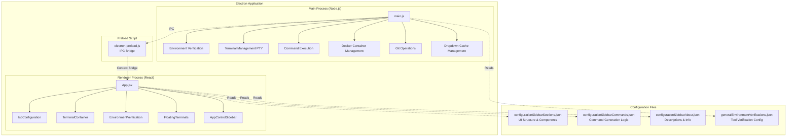
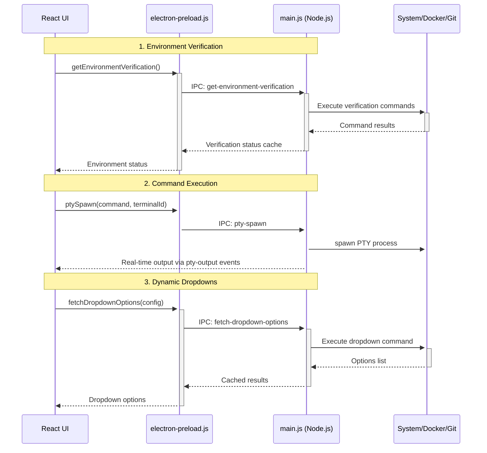
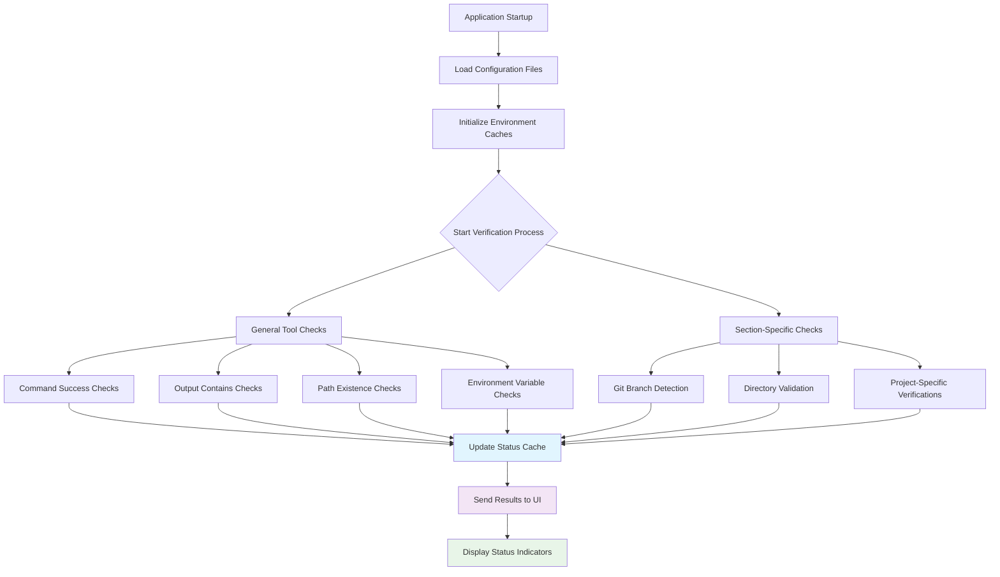
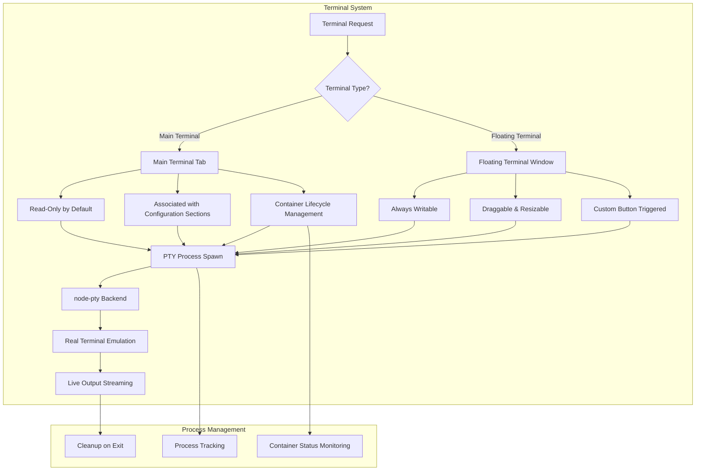
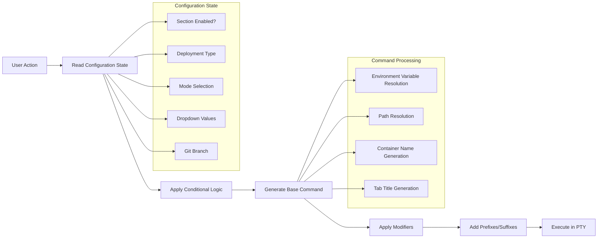
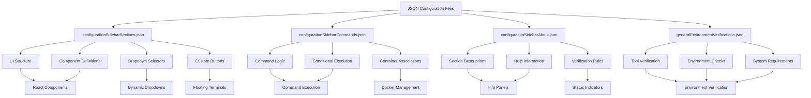
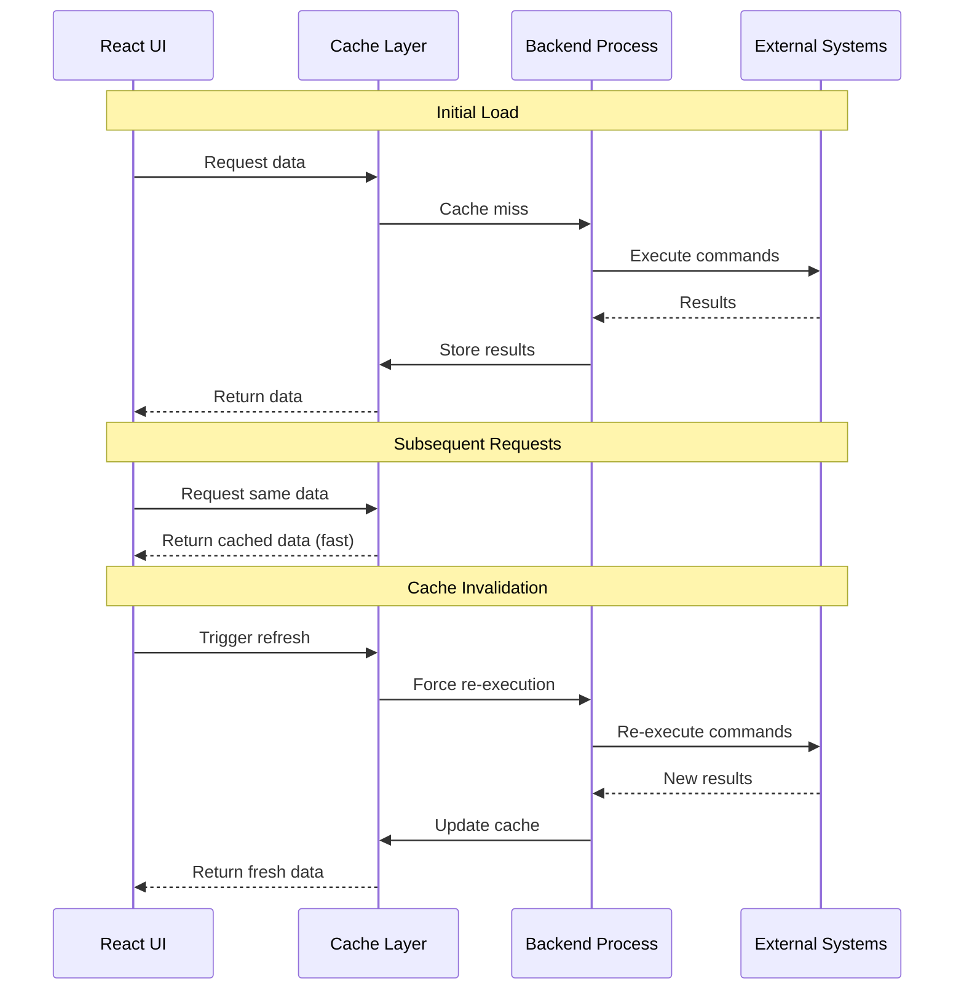
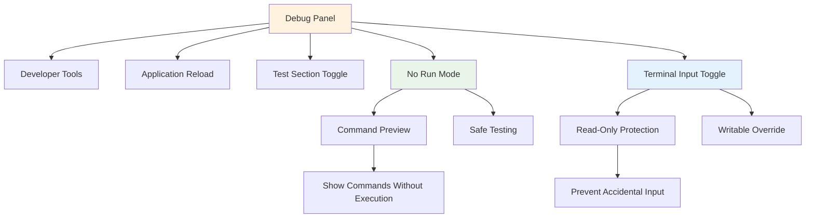

# System Architecture

This document provides a comprehensive overview of the {ProjectName} Manager's architecture, covering how components interact, data flows, and the overall system design.

## Table of Contents

- [Overview](#overview)
- [Architecture Diagram](#architecture-diagram)
- [Communication Flow](#communication-flow)
- [Environment Verification System](#environment-verification-system)
- [Terminal System Architecture](#terminal-system-architecture)
- [Command Generation & Execution](#command-generation--execution)
- [Configuration System](#configuration-system)
- [Caching & Performance](#caching--performance)
- [Safety & Debug Features](#safety--debug-features)
- [Related Documentation](#related-documentation)

## Overview

{ProjectName} Manager is an Electron-based desktop application that provides comprehensive environment management with integrated terminal support, environment verification, and dynamic configuration management. The application follows a modular, JSON-driven architecture that allows for extensive customization without code changes.

### Key Architectural Principles

- **Configuration-Driven**: All functionality defined through JSON configuration files
- **Process Isolation**: Electron's main/renderer process separation for security and stability
- **Real-time Communication**: IPC-based communication with live data streaming
- **Intelligent Caching**: Multi-layered caching for performance optimization
- **Safety First**: Read-only defaults with explicit overrides for safety

## Architecture Diagram

## Communication Flow

The application uses Electron's IPC (Inter-Process Communication) system for secure communication between the main process and renderer process.

### IPC Communication Patterns

1. **Request-Response**: For data fetching (environment verification, dropdown options)
2. **Event Streaming**: For real-time terminal output and process status updates
3. **Command Execution**: For terminal spawning and process management
4. **Cache Management**: For performance optimization and state synchronization

## Environment Verification System

The verification system provides comprehensive environment checking through a configurable JSON-based approach.

### Verification Process

1. **Parallel Execution**: All verifications run concurrently for optimal performance
2. **Progress Tracking**: Real-time progress updates sent to UI
3. **Intelligent Caching**: Results cached with invalidation strategies
4. **Error Handling**: Graceful degradation for failed verifications

### Verification Types

- **commandSuccess**: Validates command execution without errors
- **outputContains**: Checks command output for specific content
- **pathExists**: Verifies file/directory existence
- **envVarExists/envVarEquals**: Environment variable validation

See [verification-types.md](verification-types.md) for detailed information.

## Terminal System Architecture

The application features a dual-terminal system designed for different use cases and safety requirements.

### Terminal Types

#### Main Terminals
- **Purpose**: Primary command execution for configuration sections
- **Safety**: Read-only by default (debug override available)
- **Features**: Tab management, container lifecycle tracking, process monitoring
- **Use Case**: Running main application services and processes

#### Floating Terminals
- **Purpose**: Auxiliary tasks and log viewing
- **Features**: Draggable, resizable, minimizable windows
- **Trigger**: Custom buttons in configuration sections
- **Use Case**: Viewing logs, running diagnostic commands, temporary tasks

See [terminal-features.md](terminal-features.md) for detailed information.

## Command Generation & Execution

Commands are dynamically generated based on current configuration state and user selections.

### Command Processing Pipeline

1. **State Evaluation**: Current configuration state determines command variants
2. **Conditional Logic**: JSON-defined conditions control command selection
3. **Template Processing**: Environment variables and paths resolved
4. **Modifier Application**: Prefixes, suffixes, and post-modifiers applied
5. **Execution**: Commands run in appropriate terminal context

See [command-system.md](command-system.md) for detailed information.

## Configuration System

The entire application behavior is defined through JSON configuration files, enabling extensive customization without code changes.

### Configuration File Roles

| File | Purpose | Key Features |
|------|---------|-------------|
| `configurationSidebarSections.json` | UI structure and components | Sections, sub-sections, toggles, dropdowns, custom buttons |
| `configurationSidebarCommands.json` | Command generation logic | Conditional commands, modifiers, container associations |
| `configurationSidebarAbout.json` | Documentation and help | Section descriptions, verification details, help text |
| `generalEnvironmentVerifications.json` | Environment verification | Tool checks, system requirements, validation rules |

See [configuration-guide.md](configuration-guide.md) for detailed information.

## Caching & Performance

The application implements multiple caching layers for optimal performance:

### Cache Types

1. **Environment Verification Cache**: Stores verification results by section
2. **Dropdown Options Cache**: Command-based caching with dependency tracking
3. **Git Branch Cache**: Repository branch information per project
4. **Process State Cache**: Active terminal and container states

### Cache Strategies

- **Time-based Expiration**: Automatic cache invalidation
- **Dependency-based Invalidation**: Smart cache clearing based on relationships
- **Manual Refresh**: User-triggered cache clearing
- **Startup Preloading**: Critical data cached during application initialization

## Safety & Debug Features

The application includes comprehensive safety mechanisms and debugging tools:

### Safety Features

- **Read-Only Terminals**: Main terminals default to read-only mode
- **No Run Mode**: Preview commands without execution
- **Container Cleanup**: Automatic cleanup on process termination
- **Process Isolation**: Secure separation between UI and system operations

### Debug Tools

- **Chrome DevTools Integration**: Full debugging capabilities
- **Test Section Management**: Hide/show development sections
- **Live Configuration Reload**: Update behavior without restart
- **Process Monitoring**: Real-time process and container status

## Data Flow Summary

1. **Configuration Loading**: JSON files read and parsed on startup
2. **Environment Verification**: Parallel execution of all verification checks
3. **UI Rendering**: React components rendered based on configuration
4. **User Interaction**: Actions trigger command generation and execution
5. **Real-time Updates**: Live streaming of terminal output and status changes
6. **State Management**: Centralized state with intelligent caching
7. **Cleanup**: Graceful shutdown with container and process cleanup

## Performance Characteristics

- **Startup Time**: Fast startup with parallel verification loading
- **Memory Usage**: Efficient caching with automatic cleanup
- **CPU Usage**: Optimized command execution with process pooling
- **Network**: Minimal network usage, primarily for cloud resource queries
- **Disk I/O**: Efficient file operations with caching

## Related Documentation

- [Configuration Guide](configuration-guide.md) - Detailed configuration options
- [Terminal Features](terminal-features.md) - Terminal system capabilities
- [Command System](command-system.md) - Command generation and execution
- [Verification Types](verification-types.md) - Environment verification reference
- [API Reference](api-reference.md) - Internal API documentation

---

This architecture enables {ProjectName} Manager to provide a powerful, flexible, and safe environment management experience while maintaining high performance and extensibility. 