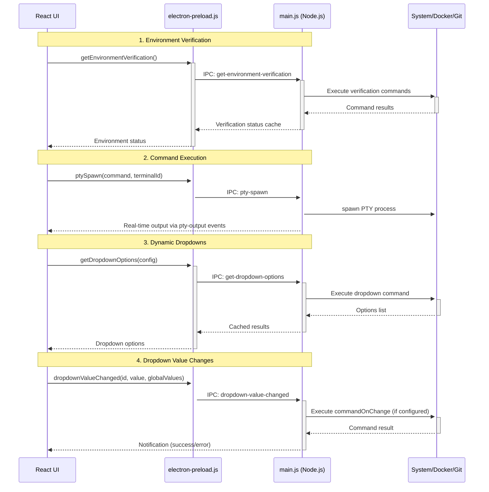
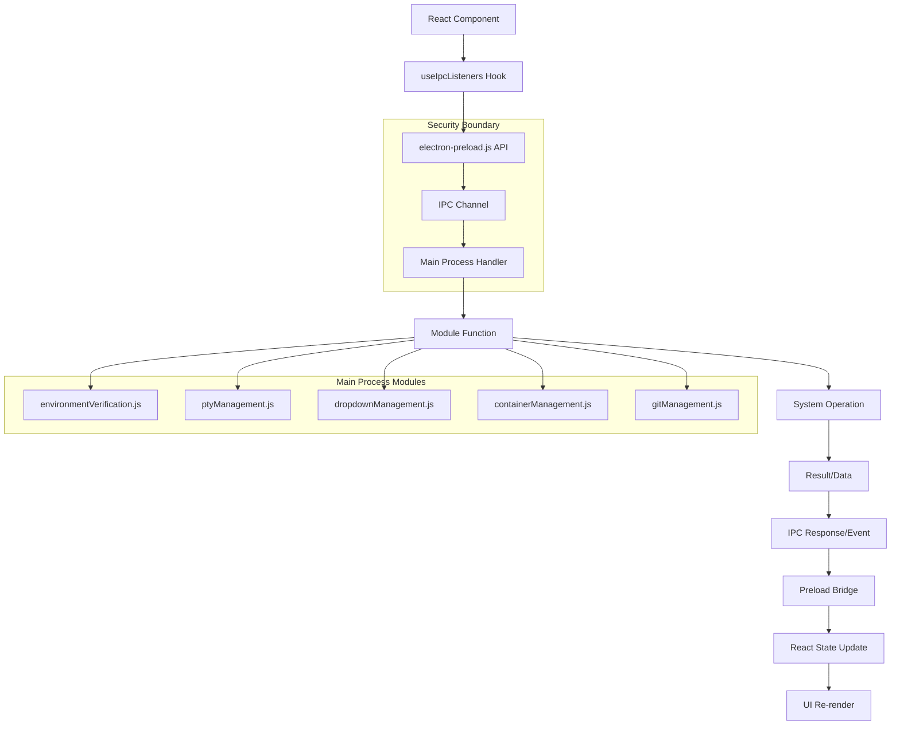

# Communication Flow

> **Navigation:** [Architecture Guides](README.md) > Communication Flow

The application uses Electron's IPC (Inter-Process Communication) system for secure communication between the main process and renderer process. This guide details the communication patterns and data flow.

## IPC Architecture Overview



## IPC Communication Patterns

### 1. Request-Response Pattern
**Usage**: For data fetching operations where the UI needs to wait for a result.

**Examples**:
- Environment verification status requests
- Dropdown option population
- Configuration file loading
- Git branch information

**Implementation**:
```javascript
// Renderer (via preload)
const result = await window.electron.getEnvironmentVerification();

// Main process
ipcMain.handle('get-environment-verification', async () => {
  return await environmentVerification.getEnvironmentVerification();
});
```

### 2. Event Streaming Pattern  
**Usage**: For real-time data updates where the main process needs to continuously send data to the UI.

**Examples**:
- Terminal output streaming
- Process status updates
- Container status monitoring
- Verification progress updates

**Implementation**:
```javascript
// Main process
mainWindow.webContents.send('pty-output', { terminalId, data });

// Renderer (via preload) 
window.electron.onPtyOutput?.((data) => {
  // Handle real-time terminal output
});
```

### 3. Command Execution Pattern
**Usage**: For triggering actions that don't require immediate response data but may have side effects.

**Examples**:
- Terminal process spawning
- Container management operations
- Git branch switching
- Configuration import/export

**Implementation**:
```javascript
// Renderer (via preload)
window.electron.ptySpawn(command, terminalId, options);

// Main process
ipcMain.on('pty-spawn', (event, command, terminalId, options) => {
  ptyManagement.spawnPTY(command, terminalId, options);
});
```

### 4. Cache Management Pattern
**Usage**: For performance optimization and state synchronization between processes.

**Examples**:
- Environment verification caching
- Dropdown option caching
- Configuration state caching
- Git branch caching

**Implementation**:
```javascript
// Main process with cache
const cache = new Map();

ipcMain.handle('get-dropdown-options', async (event, config) => {
  const cacheKey = JSON.stringify(config);
  if (cache.has(cacheKey)) {
    return cache.get(cacheKey);
  }
  
  const result = await dropdownManagement.getDropdownOptions(config);
  cache.set(cacheKey, result);
  return result;
});
```

## Context Bridge Security

The preload script (`electron-preload.js`) acts as a secure bridge between the main process and renderer process:

```javascript
// electron-preload.js
const { contextBridge, ipcRenderer } = require('electron');

contextBridge.exposeInMainWorld('electron', {
  // Secure API exposed to renderer
  getEnvironmentVerification: () => ipcRenderer.invoke('get-environment-verification'),
  ptySpawn: (command, terminalId, options) => ipcRenderer.send('pty-spawn', command, terminalId, options),
  onPtyOutput: (callback) => ipcRenderer.on('pty-output', callback),
  
  // Cleanup functions
  removeAllListeners: (channel) => ipcRenderer.removeAllListeners(channel)
});
```

**Security Benefits**:
- **No Direct Node.js Access**: Renderer process cannot directly access Node.js APIs
- **Controlled API Surface**: Only explicitly exposed functions are available
- **Type Safety**: Well-defined interfaces prevent misuse
- **Event Isolation**: Proper cleanup prevents memory leaks

## Data Flow Architecture



## IPC Handler Organization

Each main process module is responsible for registering its own IPC handlers:

### Environment Verification
```javascript
// environmentVerification.js
function setupEnvironmentIpcHandlers(ipcMain) {
  ipcMain.handle('get-environment-verification', getEnvironmentVerification);
  ipcMain.handle('refresh-environment-verification', refreshEnvironmentVerification);
  ipcMain.handle('get-environment-export-data', getEnvironmentExportData);
}
```

### Terminal Management
```javascript
// ptyManagement.js  
function setupPtyIpcHandlers(ipcMain) {
  ipcMain.on('pty-spawn', handlePtySpawn);
  ipcMain.on('pty-input', handlePtyInput);
  ipcMain.on('pty-resize', handlePtyResize);
  ipcMain.on('pty-kill', handlePtyKill);
}
```

### Dropdown Management
```javascript
// dropdownManagement.js
function setupDropdownIpcHandlers(ipcMain) {
  ipcMain.handle('get-dropdown-options', getDropdownOptions);
  ipcMain.on('dropdown-value-changed', handleDropdownValueChanged);
}
```

## Error Handling Patterns

### Graceful Error Handling
```javascript
// Main process
ipcMain.handle('risky-operation', async () => {
  try {
    return await performRiskyOperation();
  } catch (error) {
    console.error('Operation failed:', error);
    return { error: error.message };
  }
});

// Renderer process
const result = await window.electron.performRiskyOperation();
if (result.error) {
  showNotification(result.error, 'error');
} else {
  // Handle success
}
```

### Event Error Broadcasting
```javascript
// Main process
try {
  await performOperation();
  mainWindow.webContents.send('operation-success', data);
} catch (error) {
  mainWindow.webContents.send('operation-error', error.message);
}
```

## Performance Optimizations

### Debouncing Frequent Requests
```javascript
// Debounced environment verification
const debouncedVerification = debounce(async () => {
  const result = await window.electron.getEnvironmentVerification();
  setVerificationStatus(result);
}, 500);
```

### Batched Updates
```javascript
// Batch multiple status updates
const statusBatch = [];
const flushStatusUpdates = debounce(() => {
  mainWindow.webContents.send('batch-status-update', statusBatch);
  statusBatch.length = 0;
}, 100);
```

### Smart Caching
```javascript
// Cache with TTL
const cache = new Map();
const CACHE_TTL = 30000; // 30 seconds

ipcMain.handle('cached-operation', async (event, key) => {
  const cached = cache.get(key);
  if (cached && Date.now() - cached.timestamp < CACHE_TTL) {
    return cached.data;
  }
  
  const data = await expensiveOperation(key);
  cache.set(key, { data, timestamp: Date.now() });
  return data;
});
```

## Real-time Communication Examples

### Terminal Output Streaming
```javascript
// Main process
ptyProcess.onData((data) => {
  mainWindow.webContents.send('pty-output', {
    terminalId,
    data,
    timestamp: Date.now()
  });
});

// Renderer process
window.electron.onPtyOutput?.((event) => {
  const { terminalId, data, timestamp } = event;
  updateTerminalOutput(terminalId, data);
});
```

### Progress Updates
```javascript
// Main process
async function longRunningOperation() {
  for (let i = 0; i <= 100; i += 10) {
    await performStep(i);
    mainWindow.webContents.send('progress-update', {
      operation: 'environment-verification',
      progress: i,
      total: 100
    });
  }
}

// Renderer process
window.electron.onProgressUpdate?.((event) => {
  const { operation, progress, total } = event;
  updateProgressBar(operation, progress / total);
});
```

## IPC Channel Naming Conventions

- **Commands**: `kebab-case` verbs (e.g., `get-environment-verification`, `pty-spawn`)
- **Events**: `kebab-case` with suffixes (e.g., `pty-output`, `status-update`, `progress-update`)
- **Responses**: Match request names or use descriptive event names
- **Cleanup**: Include removal functions for event listeners

## Related Documentation

- [Main Process Architecture](main-process.md) - Backend modules and IPC handlers
- [Renderer Process Architecture](renderer.md) - Frontend IPC usage patterns  
- [Performance Optimization](performance.md) - Caching and optimization strategies
- [Security Guide](../development/security.md) - IPC security best practices 