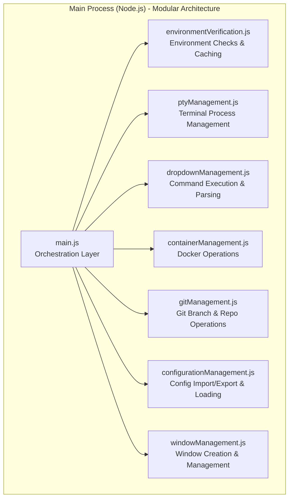

# Main Process Architecture

> **Navigation:** [Architecture Guides](README.md) > Main Process

The main process has been refactored into a modular architecture for better maintainability, testing, and separation of concerns. Each module, located in `src/main-process/`, handles a specific domain of functionality.

## Architecture Overview



## Core Modules

### `main.js` - Orchestration Layer
- **Purpose**: Application lifecycle management and IPC handler registration
- **Responsibilities**: Window creation, IPC routing, startup coordination, modular IPC handler setup
- **Dependencies**: All other modules as imports
- **Modular Architecture**: Delegates IPC handler setup to specialized modules (e.g., `dropdownManagement.setupDropdownIpcHandlers()`)

### `environmentVerification.js` - Environment Management
- **Purpose**: System environment checking and verification
- **Responsibilities**: Tool validation, path checking, environment variables, caching, command output capture
- **Key Functions**: `verifyEnvironment()`, `refreshEnvironmentVerification()`, `getEnvironmentVerification()`, `getEnvironmentExportData()`
- **Export Feature**: Captures and exports all verification command outputs with status for debugging

### `ptyManagement.js` - Terminal Process Management
- **Purpose**: PTY (pseudo-terminal) process lifecycle management with advanced monitoring
- **Responsibilities**: Process spawning, I/O handling, cleanup, tracking, real-time status detection, control character monitoring
- **Key Functions**: `spawnPTY()`, `killProcess()`, `writeToPTY()`, `resizePTY()`, `startProcessMonitoring()`, `getChildProcesses()`, `interpretProcessState()`
- **Monitoring Features**: Process tree discovery, state interpretation, control character detection, exit code capture

### `containerManagement.js` - Docker Operations
- **Purpose**: Docker container lifecycle management
- **Responsibilities**: Container status checking, stopping, event emission
- **Key Functions**: `getContainerStatus()`, `stopContainers()`, container status monitoring

### `gitManagement.js` - Git Repository Operations
- **Purpose**: Git branch management and repository operations
- **Responsibilities**: Branch switching, listing, caching, path resolution
- **Key Functions**: `checkoutGitBranch()`, `listLocalGitBranches()`, `getGitBranch()`, cache management

### `dropdownManagement.js` - Command Execution & Parsing
- **Purpose**: Dynamic dropdown population, command parsing, and change command execution
- **Responsibilities**: Command execution, response parsing, caching, dependency handling, IPC handler setup, change command execution
- **Key Functions**: `getDropdownOptions()`, `executeDropdownChangeCommand()`, `setupDropdownIpcHandlers()`, cache management
- **New Features**: Automatic command execution on dropdown value changes with variable substitution

### `configurationManagement.js` - Configuration Management
- **Purpose**: Application configuration loading, import/export
- **Responsibilities**: File I/O, JSON parsing, dialog handling, settings management
- **Key Functions**: `loadAppSettings()`, `importConfiguration()`, `exportConfiguration()`, `getAboutConfig()`

### `windowManagement.js` - Window Management
- **Purpose**: Electron window creation and management
- **Responsibilities**: Window options, DevTools handling, display settings integration
- **Key Functions**: `createWindow()`, window lifecycle management

## Benefits of Modular Architecture

- **Separation of Concerns**: Each module has a single, well-defined responsibility
- **Testability**: Individual modules can be tested in isolation with proper mocking
- **Maintainability**: Easier to locate and modify specific functionality
- **Reusability**: Modules can be imported and used across different parts of the application
- **Error Isolation**: Issues in one module don't cascade to others
- **Performance**: Lazy loading and efficient resource management per module

## File Structure

```
src/main-process/
├── main.js                      # Entry point and orchestration
├── environmentVerification.js   # Environment checking and caching
├── ptyManagement.js             # Terminal process management
├── dropdownManagement.js        # Dropdown data and commands
├── containerManagement.js       # Docker container operations
├── gitManagement.js             # Git repository operations
├── configurationManagement.js   # Configuration I/O
├── windowManagement.js          # Window creation and management
└── mainUtils.js                 # Shared utilities
```

## IPC Handler Registration

Each module is responsible for registering its own IPC handlers. This modular approach keeps related handlers grouped together:

```javascript
// In main.js
dropdownManagement.setupDropdownIpcHandlers(ipcMain);

// In dropdownManagement.js
function setupDropdownIpcHandlers(ipcMain) {
  ipcMain.handle('get-dropdown-options', async (event, config) => {
    return await getDropdownOptions(config);
  });
  
  ipcMain.on('dropdown-value-changed', async (event, data) => {
    // Handle dropdown changes
  });
}
```

## Development Environment

The project is configured with a robust ESLint setup to ensure code quality and prevent common errors. The configuration (`eslint.config.js`) includes plugins for:

- **Imports (`eslint-plugin-import`)**: Validates module paths and prevents resolution errors.
- **Promises (`eslint-plugin-promise`)**: Enforces best practices for handling Promises.
- **Node.js (`eslint-plugin-n`)**: Enforces Node.js best practices and style.

This setup was instrumental in identifying and fixing pathing issues after the major file restructure.

## Related Documentation

- [Renderer Process Architecture](renderer.md) - Frontend React architecture
- [Communication Flow](communication.md) - IPC system and data flow
- [Performance Optimization](performance.md) - Caching and optimization strategies
- [Configuration System](../configuration/overview.md) - JSON configuration details 