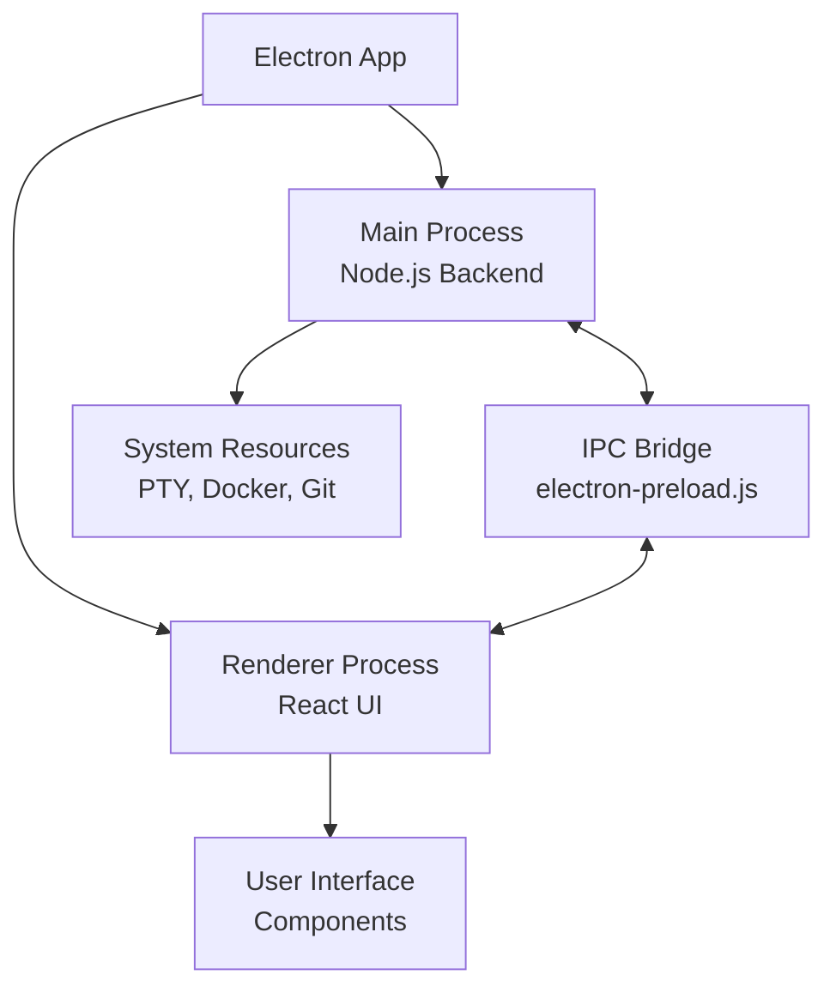
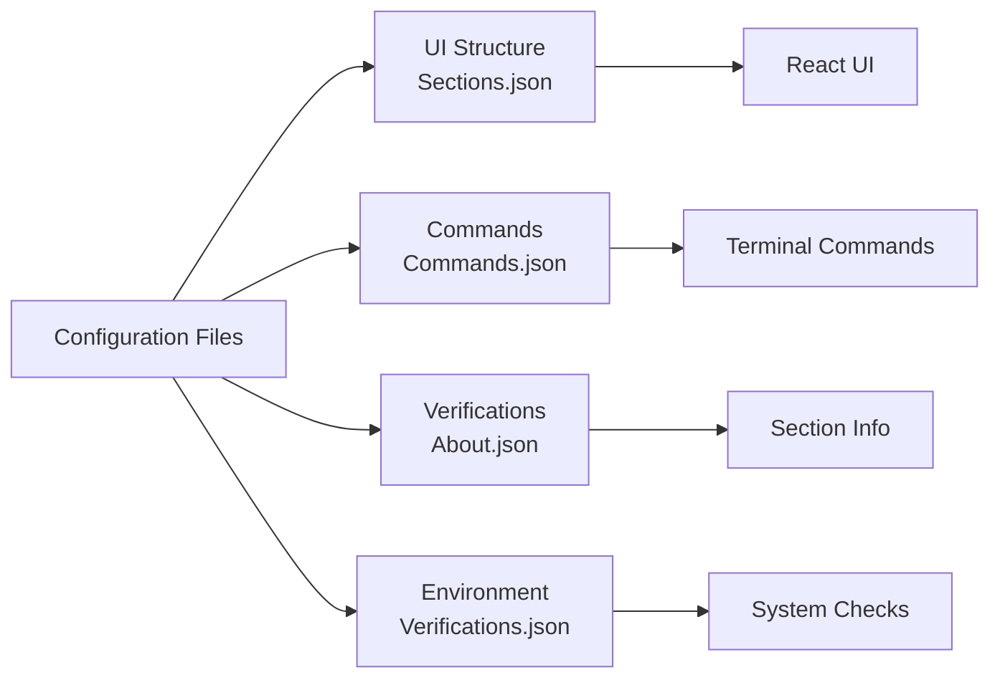

# Architecture Overview

> **Navigation:** [Architecture Guides](README.md) > Overview

This document provides a high-level overview of {ProjectName} Manager's architecture. For detailed technical information, see the other architecture guides.

## Core Architecture Principles

- **Configuration-Driven**: All functionality defined through JSON configuration files
- **Process Isolation**: Electron's main/renderer process separation for security
- **Real-time Communication**: IPC-based messaging with live data streaming
- **Modular Design**: Feature-based architecture for maintainability
- **Safety First**: Read-only defaults with explicit overrides

## System Components

### 1. Electron Application Structure

### 2. Main Process Modules

Located in `src/main-process/`, each module handles specific functionality:

- **`main.js`**: Application lifecycle and IPC routing
- **`environmentVerification.js`**: System checks and caching
- **`ptyManagement.js`**: Terminal process management
- **`containerManagement.js`**: Docker lifecycle
- **`gitManagement.js`**: Repository operations
- **`dropdownManagement.js`**: Dynamic dropdown data
- **`configurationManagement.js`**: Config import/export
- **`windowManagement.js`**: Window creation

> **Detailed Information**: See [Main Process Architecture](main-process.md)

### 3. Renderer Process Components

Feature-based organization in `src/`:

- **`common/`**: Shared components and hooks
- **`project-config/`**: Configuration UI
- **`terminal/`**: Main terminal system
- **`floating-terminal/`**: Floating windows
- **`auto-setup/`**: Automated setup
- **`health-report/`**: Service monitoring
- **`environment-verification/`**: Verification UI

> **Detailed Information**: See [Renderer Process Architecture](renderer.md)

### 4. Configuration System

JSON files drive all behavior:

> **Detailed Information**: See [Configuration Guides](../configuration/)

## Data Flow

### 1. Startup Sequence
1. Electron app launches
2. Configuration files loaded
3. Environment verifications run
4. UI renders based on configuration
5. IPC channels established

### 2. Command Execution Flow
1. User enables section
2. Command generated from JSON
3. Terminal spawned via PTY
4. Real-time output streamed
5. Process status monitored

### 3. Verification Flow
1. Check definitions loaded from JSON
2. Commands executed in parallel
3. Results cached for performance
4. UI updated with status indicators
5. Fix buttons shown for failures

> **Detailed Information**: See [Communication Flow](communication.md)

## Key Features Architecture

### Terminal System
- **Main Terminals**: Tabbed interface for primary commands
- **Floating Terminals**: Independent windows for auxiliary tasks
- **Process Monitoring**: Real-time status detection
- **Container Management**: Lifecycle tied to terminal tabs

> **Detailed Information**: See [Terminal System Features](../features/terminal-system.md)

### Auto Setup System
- **Priority Groups**: Sequential execution order
- **Parallel Execution**: Within-group parallelization
- **Smart Terminals**: Auto-minimized floating windows
- **Progress Tracking**: Real-time status updates

> **Detailed Information**: See [Auto Setup Features](../features/auto-setup.md)

### Health Report
- **Centralized Monitoring**: All services in one view
- **Combined Status**: Process + container health
- **Real-time Updates**: Automatic refresh
- **Interactive Controls**: Direct service management

> **Detailed Information**: See [Health Report Features](../features/health-report.md)

## Performance Optimizations

- **Multi-layer Caching**: Verification, dropdown, and git data
- **Lazy Loading**: Components loaded as needed
- **Efficient IPC**: Batched updates and streaming
- **Resource Cleanup**: Automatic process termination

> **Detailed Information**: See [Performance Optimization](performance.md)

## Security Considerations

- **Process Isolation**: Main/renderer separation
- **Read-only Defaults**: Terminals protected by default
- **Contextual Bridge**: Limited API exposure
- **Safe Command Execution**: No arbitrary code execution

## Development Architecture

### Testing Strategy
- **Unit Tests**: Individual module testing
- **Component Tests**: React component behavior
- **E2E Tests**: Full workflow validation
- **Mock Environment**: Comprehensive test infrastructure

### Code Organization
- **Feature-based Structure**: Related code grouped together
- **Custom Hooks**: Reusable logic extraction
- **Modular Design**: Clear separation of concerns
- **Type Safety**: PropTypes for validation

> **Detailed Information**: See [Development Testing Guide](../development/testing.md)

## Technology Stack

### Core Technologies
- **Electron**: Cross-platform desktop application framework
- **React**: Frontend UI library with hooks-based architecture
- **Node.js**: Backend runtime for main process
- **node-pty**: Terminal emulation and process management

### Development Tools
- **Jest**: Testing framework for unit and integration tests
- **Playwright**: End-to-end testing automation
- **ESLint**: Code quality and style enforcement
- **Webpack**: Module bundling and build process

### System Integration
- **Docker**: Container management and lifecycle
- **Git**: Repository operations and branch management
- **Shell**: Command execution through PTY processes

## Next Steps

- **Implementation Details**: See [Main Process](main-process.md) and [Renderer Process](renderer.md)
- **Communication Patterns**: Read [Communication Flow](communication.md)
- **Performance Details**: Check [Performance Optimization](performance.md)
- **Configuration System**: Explore [Configuration Guides](../configuration/)
- **Feature Details**: Browse [Feature Guides](../features/)
- **Development Info**: Visit [Development Guides](../development/) 