# Simulation System

> Complete replacement for external tools with controlled, predictable simulators

## Overview

The simulation system replaces all external dependencies (Docker, gcloud, kubectl, etc.) with intelligent simulators. This means developers can run {ProjectName} Manager immediately after `npm install` without installing any external tools, while maintaining realistic behavior for testing and development.

## Why Use Simulators?

**Before**: Developers needed Docker, gcloud, kubectl, Node.js, Go, Java, and more
**After**: Everything works with just Node.js installed

### Key Benefits
- **Zero Setup**: Works immediately after `npm install`
- **Consistent Results**: No network failures, API limits, or tool version conflicts
- **Faster Testing**: E2E tests run reliably without external dependencies
- **Complete Control**: Easy to test both success and failure scenarios

## Architecture

The system consists of three interconnected simulators that provide realistic behavior without real operations:

```mermaid
flowchart TD
    GCS["📦 Generic Command<br/>Simulator<br/><br/>• Container mgmt<br/>• Build processes<br/>• Development runs"]
    VS["✅ Verification<br/>Simulator<br/><br/>• Tool verification<br/>• Fix commands<br/>• Environment checks"]
    DS["📋 Dropdown<br/>Simulator<br/><br/>• Project lists<br/>• Context lists<br/>• Pod selections"]
    
    CONFIG["⚙️ Configuration<br/>Files<br/><br/>• Sections<br/>• Commands<br/>• Verifications"]
    
    GCS --> CONFIG
    VS --> CONFIG
    DS --> CONFIG
    
    subgraph " "
        GCS
        VS  
        DS
    end
```



### 1. Generic Command Simulator

**What it does**: Replaces build, run, and container commands with realistic simulations

**Key features**:
- ⏱️ Configurable timing (30 seconds, infinite, etc.)
- 🎯 Success/failure control for testing scenarios  
- 📦 Container lifecycle simulation
- 🔧 Environment variable display

**Quick example**:
```bash
# Simulate a 30-second build process
node scripts/simulators/generic-command-simulator.js --duration=30 --result=success
```

### 2. Verification Simulator  

**What it does**: Simulates tool checks (Docker, gcloud, kubectl) without requiring actual installation

**Key features**:
- ✅ Realistic tool responses (matches real command output)
- 🔄 Session-based state persistence (using main Electron PID tracking)
- 🛠️ Fix command simulation with immediate effect
- 🎛️ Environment variable control (`VERIFICATION_SHOULD_FAIL`)
- 🔄 Automatic clean slate on app restart

**Quick example**:
```bash
# Check if gcloud is "installed"
node scripts/simulators/verification-simulator.js verify cloudGcloudCLI

# Fix a verification (persists until app restart)
node scripts/simulators/verification-simulator.js fix cloudGcloudCLI

# Test failure scenarios
VERIFICATION_SHOULD_FAIL=true node scripts/simulators/verification-simulator.js verify nodeJs
```

**Session State Management**:
The verification simulator maintains session state using the main Electron process PID:
- **Fix commands** set `sessionState[verificationId] = true` and persist to disk
- **Verify commands** check session state first, then fall back to environment variables
- **App restart** automatically clears session state (new PID = clean slate)
- **Session file** is shared between all verification processes within the same app session

### 3. Dropdown Simulator

**What it does**: Provides realistic dropdown data for UI components (projects, contexts, pods)

**Key features**:
- 🔄 Time-based variation (changes every 30 seconds for demos)
- 🏷️ Generic naming conventions  
- 📝 Multiple output formats (lines, JSON)
- 🎯 Auto-detection from command strings

**Quick example**:
```bash
# Generate project list for dropdown
node scripts/simulators/dropdown-simulator.js gcloud-projects

# Get kubectl contexts as JSON
node scripts/simulators/dropdown-simulator.js kubectl-contexts --json
```

## How It Works

The simulators integrate seamlessly with the existing configuration system by replacing real commands:

### Command Integration
Real Docker/build commands → Generic command simulator
```json
// Before: "cd ./project-a && docker-compose up -d"
// After:  "node ./ProjectName-Manager/scripts/simulators/generic-command-simulator.js --duration=30"
```

### Verification Integration  
Real tool checks → Verification simulator
```json
// Before: "gcloud --version"
// After:  "node ./ProjectName-Manager/scripts/simulators/verification-simulator.js verify cloudGcloudCLI"
```

### Dropdown Integration
Real API calls → Dropdown simulator
```json
// Before: "gcloud projects list --format=value(projectId)"
// After:  "node ./ProjectName-Manager/scripts/simulators/dropdown-simulator.js gcloud-projects"
```

## Generic Naming

All simulated data uses generic names to avoid project-specific references:

- **Projects**: `project-a`, `project-b`, `project-c`
- **Services**: `service-a`, `service-b`, `service-c`  
- **Containers**: `container-a`, `container-b`, `container-c`
- **Cloud Resources**: `project-a-dev-abe5983f`, `gke_project-a-dev_us-central1_dev-cluster`

This ensures the codebase can be shared without exposing real project names or infrastructure details.

## Development Workflow

### Getting Started
1. Clone the repository
2. Run `npm install` 
3. Start the app immediately - no external tools needed!

### Testing Scenarios
```bash
# Test success scenario (default)
npm start

# Test failures to see error handling  
VERIFICATION_SHOULD_FAIL=true npm start

# Run E2E tests without external dependencies
npm run test:e2e
```

### Integration with Testing

The simulators work seamlessly with both Jest and E2E tests:

- **Jest Tests**: Mock data ensures consistent unit test results
- **E2E Tests**: Simulators replace real tools in Playwright tests  
- **CI/CD**: GitHub Actions runs without installing Docker, gcloud, etc.

## Common Tasks

### Testing Failure Scenarios
```bash
# Force all verifications to fail initially (can be fixed via UI)
VERIFICATION_SHOULD_FAIL=true npm start

# Test individual verification (respects session state)
node scripts/simulators/verification-simulator.js verify cloudGcloudCLI

# Test fix command (persists until app restart)
node scripts/simulators/verification-simulator.js fix cloudGcloudCLI
```

### Adding New Tools
To add support for a new tool (e.g., `terraform`):

1. **Add verification response** in `verification-simulator.js`:
   ```javascript
   'terraformCLI': {
     success: 'Terraform v1.6.0',
     failure: 'terraform: command not found',
     type: 'outputContains',
     expectedValue: 'Terraform'
   }
   ```

2. **Update configuration** to use the simulator:
   ```json
   {
     "id": "terraformCLI",
     "command": "node ./ProjectName-Manager/scripts/simulators/verification-simulator.js verify terraformCLI"
   }
   ```

### Adding New Dropdown Data
To support a new dropdown type:

1. **Add generator function** in `dropdown-simulator.js`
2. **Add case handler** for the new command type
3. **Update configuration** to use the new simulator command

## Troubleshooting

### Simulator Not Found
```bash
# Make sure simulators are executable
chmod +x scripts/simulators/*.js

# Test simulator directly
node scripts/simulators/verification-simulator.js verify cloudGcloudCLI
```

### Verification Always Fails
- Check that verification IDs match between config and simulator
- Restart the app to reset verification session state
- Remove `VERIFICATION_SHOULD_FAIL=true` environment variable
- Try using fix commands via the UI to override individual verifications

### Dropdown Data Missing
- Verify command type is supported in dropdown simulator
- Check that dropdown command uses correct format

## Best Practices

### Development
- Use simulators for all local development to avoid external dependencies
- Test both success and failure scenarios with environment variables
- Keep simulator responses realistic to catch integration issues

### Testing  
- Use simulators in E2E tests for consistent, reliable results
- Test edge cases by configuring simulator behavior
- Verify that simulator outputs match what the UI expects

### Configuration
- Use generic naming conventions for all simulated data
- Keep simulator commands consistent across configuration files
- Document any custom simulator additions for team members

## See Also

- [Testing Framework](./testing.md) - How simulators integrate with testing
- [Configuration Guide](../configuration/) - Configuration file formats
- [Architecture Guide](../architecture/) - System architecture overview 