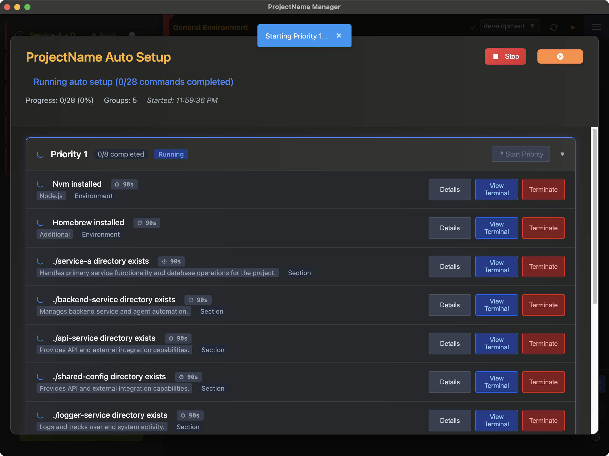

# Auto Setup

> One-click automated environment configuration with intelligent fix command execution

<div align="center">
  
  <p><em>Auto Setup screen showing priority-grouped commands with real-time progress tracking</em></p>
</div>

## Overview

Auto Setup transforms the tedious process of environment configuration into a single-click operation. This powerful feature intelligently manages all your fix commands, ensuring your development environment is properly configured in minutes instead of hours.

### What Auto Setup Does

- **Detects Issues**: Automatically finds all failing verifications
- **Organizes Solutions**: Groups fix commands by priority
- **Executes Intelligently**: Runs commands in optimal order
- **Tracks Progress**: Real-time status updates with visual feedback
- **Handles Failures**: Graceful error recovery with retry options
- **Safe Testing**: No Run Mode for risk-free workflow testing

## Key Features

### Smart Priority Group Management
- **Auto-expansion**: Currently running priority groups expand automatically
- **Auto-collapse**: Completed groups collapse to reduce visual clutter  
- **Focus Management**: Always shows the most relevant section for current activity
- **Manual Override**: Your expand/collapse preferences are preserved for completed groups

### Enhanced No Run Mode
- **Safe Testing**: Complete workflow testing without system changes
- **Visual Simulation**: Commands display with clear `[NO-RUN MODE]` indicators
- **Realistic Timing**: 8-second execution simulation with progress feedback
- **Persistent Warning**: Always-visible warning pinned to bottom of screen
- **Smart Limitations**: Start and retry buttons appropriately disabled for safety

### Improved User Experience
- **Priority-based Organization**: Commands grouped by execution order
- **Real-time Status**: Live updates with color-coded progress indicators
- **Terminal Integration**: Seamless viewing of command output
- **Error Recovery**: Individual command retry with detailed feedback
- **Command Control**: Terminate running commands and continue from failures
- **Timeout Management**: Configurable automatic timeouts (default 60 seconds) with visual countdown

## Getting Started

### Prerequisites

- At least one verification with a `fixCommand` must be failing
- Fix commands must have `fixPriority` configured (defaults to 999 if not set)
- Project must not be currently running

### Basic Usage

1. **Open Auto Setup**
   - Click the wrench icon (🔧) in the App Control Sidebar
   - The Auto Setup screen will open showing all available fix commands

2. **Review Commands**
   - Commands are grouped by priority (1, 2, 3, etc.)
   - Each group shows the number of commands and their current status
   - Expand groups to see individual commands
   - **No Run Mode**: If enabled, you'll see a persistent warning pinned to the bottom

3. **Start Setup**
   - Click "Start Auto Setup" to begin execution
   - Watch the progress indicator and group statuses
   - Commands in the same priority run in parallel

4. **Monitor Progress**
   - Groups turn blue when running, green when complete, red if failed
   - **Auto-expansion**: Running groups expand automatically, completed groups collapse
   - Individual commands show their execution status with icons
   - Overall progress is displayed in the header
   - Manual expand/collapse preferences are preserved for completed groups

5. **Handle Issues**
   - If a command fails, Auto Setup stops automatically
   - Click "View Terminal" to see the command output
   - Use "Terminate" to stop running commands that are taking too long
   - Use "Retry" to re-run failed commands
   - Use "Continue" on failed priority groups to proceed to next priority
   - Or fix the issue manually and continue

6. **Monitor Command Timeouts**
   - Commands automatically timeout after the configured timeout (default 60 seconds, configurable via `autoSetupTimeoutSeconds` in settings)
   - Running commands show a live countdown timer (⏱ 45s)
   - Timer turns yellow when ≤10 seconds remain with pulsing animation
   - Timed out commands can be retried individually

## Configuration

### Adding Fix Priorities

**For section verifications** (`configurationSidebarAbout.json`):
```json
{
  "sectionId": "mirror",
  "verifications": [
    {
      "id": "mirrorDirExists",
      "title": "./weblifemirror directory exists",
      "fixCommand": "git clone https://github.com/...",
      "fixPriority": 1
    }
  ]
}
```

**For environment verifications** (`generalEnvironmentVerifications.json`):
```json
{
  "verifications": [
    {
      "id": "homebrewInstalled",
      "title": "Homebrew installed",
      "fixCommand": "/bin/bash -c \"$(curl -fsSL ...)\"",
      "fixPriority": 1
    }
  ]
}
```

### Priority Best Practices

#### Priority 1: Foundation Tools
- Package managers (Homebrew, apt, yum)
- Basic command-line tools
- Directory creation

#### Priority 2: Development Environments
- Programming languages (Node.js, Go, Java, Python)
- Version managers (nvm, gvm)
- Environment variables

#### Priority 3: Specialized Tools
- Cloud CLIs (gcloud, kubectl, aws)
- Container runtimes (Docker, Rancher)
- Development tools

#### Priority 4: Project-Specific Setup
- Project repositories
- Optional tools
- Final configuration

### Example Priority Configuration

```json
{
  "verifications": [
    {
      "id": "homebrewInstalled",
      "fixCommand": "install_homebrew_script",
      "fixPriority": 1
    },
    {
      "id": "nodeJsInstalled", 
      "fixCommand": "nvm install 16",
      "fixPriority": 2
    },
    {
      "id": "gcloudInstalled",
      "fixCommand": "brew install --cask google-cloud-sdk",
      "fixPriority": 3
    },
    {
      "id": "projectRepo",
      "fixCommand": "git clone ...",
      "fixPriority": 4
    }
  ]
}
```

## Terminal Management

### Auto Setup Terminals

- **Dedicated**: Each fix command runs in its own terminal
- **Auto-minimized**: Start minimized to avoid clutter
- **Hidden**: Don't appear in the regular App Control Sidebar terminal list
- **Tagged**: Marked with `isAutoSetup: true` flag

### Viewing Terminal Output

1. **From Auto Setup Screen**: Click "View Terminal" next to any running command
2. **Terminal Features**: 
   - Real-time output display
   - Command completion detection
   - Exit code reporting
   - Auto-close on success (when minimized)

### Terminal Lifecycle

1. **Creation**: Terminal created when command starts
2. **Execution**: Command runs with live output
3. **Completion**: Status updated based on exit code
4. **Cleanup**: Successful terminals auto-close after delay

## Error Handling

### Common Scenarios

#### Command Fails
- Auto Setup stops executing subsequent groups
- Failed command shows red status with appropriate icon
- Terminal remains open for debugging
- Use "View Terminal" to see error details
- Click "Retry" to re-run after fixing issues
- Use "Continue" button to proceed to next priority group

#### Command Timeouts
- Commands automatically timeout after the configured timeout (default 60 seconds, configurable via `autoSetupTimeoutSeconds` in settings)
- Timeout commands show red clock icon and "Timeout" status
- Use "Terminate" button to manually stop long-running commands
- Timed out commands can be retried individually
- Visual countdown shows remaining time with color warnings

#### Long-Running Commands
- Use "Terminate" button to stop commands taking too long
- Terminated commands show "Stopped" status
- Can be retried after manual intervention
- Terminal output remains available for debugging

#### Network Issues
- Commands may timeout or fail to download
- Check network connectivity
- Retry individual commands as needed

#### Permission Issues
- Some commands may require elevated privileges
- Terminal output will show permission errors
- May need to run specific commands manually with sudo

#### Dependency Conflicts
- Earlier commands may conflict with later ones
- Review the execution order and priorities
- Consider splitting into separate priority groups

### Recovery Strategies

1. **Individual Retry**: Fix specific failing commands
2. **Manual Termination**: Use "Terminate" to stop long-running commands
3. **Priority Group Continue**: Use "Continue" to proceed despite group failures
4. **Manual Intervention**: Run commands manually if needed
5. **Priority Adjustment**: Modify priorities if dependencies are wrong
6. **Partial Completion**: Some commands may succeed even if others fail

## Advanced Features

### Integration with Other Features

#### Test Sections
- Auto Setup respects test section visibility
- Hidden test sections' fix commands are excluded
- Toggle test section visibility to include/exclude their commands

#### No Run Mode
- When enabled, provides safe testing of the Auto Setup workflow
- **Start Button**: Disabled with tooltip explaining limitation
- **Command Simulation**: Commands display with `[NO-RUN MODE]` indicator
- **Execution Simulation**: 2-second delay with visual feedback, then shows `[SIMULATED SUCCESS]`
- **Workflow Testing**: Full priority execution, progress tracking, and status updates work normally
- **Safety**: Zero system impact - perfect for testing Auto Setup logic
- **Retry Limitation**: Retry buttons are disabled in No Run Mode
- **Persistent Warning**: Pinned warning at bottom of screen for constant visibility

#### Verification Re-run
- Successful fix commands trigger automatic verification re-run
- Ensures the fix actually resolved the issue
- Updated verification status reflects in the UI

### Debugging

#### Enable Debug Logs
```bash
DEBUG_LOGS=true npm start
```

#### Check Command Collection
- Open Auto Setup screen to see which commands are detected
- Verify priorities are assigned correctly
- Ensure failing verifications have fix commands

#### Monitor Terminal Output
- Use "View Terminal" for real-time command output
- Check exit codes and error messages
- Look for dependency or permission issues
- **No Run Mode**: Terminals show simulation with 2-second delays and success indicators

## Best Practices

### Configuration
- Always test fix commands manually first
- Use appropriate priorities based on dependencies
- Include descriptive verification titles
- Test with various system states

### Usage
- Review the command list before starting (priority groups auto-expand/collapse for focus)
- **Test First**: Use No Run Mode to safely test the complete Auto Setup workflow
- Monitor progress and be ready to intervene
- Use "View Terminal" for long-running commands
- Don't close the Auto Setup screen while running
- Let completed groups collapse automatically to focus on active work

### Maintenance
- Regularly review and update fix commands
- Adjust priorities as dependencies change
- Test Auto Setup on clean systems
- Document any manual steps required

## See Also

- [Configuration Commands Guide](../configuration/commands.md) - Setting up fix commands
- [Environment Verification](verification.md) - Understanding verification system
- [Terminal System](terminal-system.md) - Terminal behavior and management 