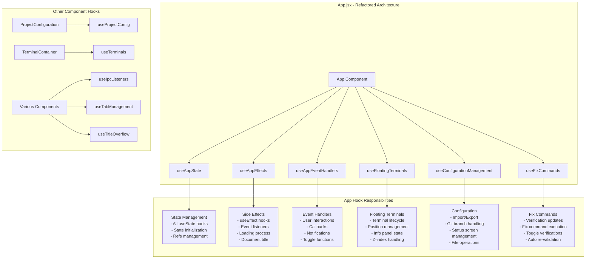

# Renderer Process Architecture

> **Navigation:** [Architecture Guides](README.md) > Renderer Process

The renderer process is built with React and follows a modern, modular architecture centered around components and custom hooks. This mirrors the modularity of the main process, ensuring the codebase is scalable and maintainable.

## Component Hierarchy

- **Container Components**: High-level components like `ProjectConfiguration` and `TerminalContainer` manage state and orchestrate their children.
- **Presentational Components**: Smaller, reusable components like `RunButton`, `TerminalPlaceholder`, and `ConfigSection` focus on rendering specific pieces of the UI.
- **Custom Hooks**: Complex, reusable stateful logic is extracted into custom hooks for better organization and testability.

## App Component Architecture

The main `App.jsx` component follows a clean, modular architecture using custom hooks:



## Custom Hooks Architecture

| Hook | Purpose | Key Responsibilities | Location |
|------|---------|---------------------|-----------|
| `useAppState` | State Management | All useState hooks, refs, initialization functions | `src/common/hooks/` |
| `useAppEffects` | Side Effects | useEffect hooks, event listeners, loading process, git refresh | `src/common/hooks/` |
| `useAppEventHandlers` | Event Handling | User interactions, callbacks, notifications, toggle functions | `src/common/hooks/` |
| `useFloatingTerminals` | Terminal Management | Floating terminal lifecycle, positioning, info panels | `src/floating-terminal/` |
| `useConfigurationManagement` | Configuration | Import/export, git operations, status screens | `src/project-config/hooks/` |
| `useFixCommands` | Fix Commands | Fix command execution, verification updates, toggle verifications | `src/project-config/hooks/` |
| `useAutoSetup` | Auto Setup | Priority-based command execution, progress tracking, smart terminal management | `src/auto-setup/` |

> **Note**: These hooks are feature-specific and located within their respective module directories, reflecting the modular architecture. The App component imports and orchestrates them, but each hook is maintained within its related feature domain.

## Benefits of the Modular Architecture

- **Separation of Concerns**: Each hook has a single, well-defined responsibility
- **Testability**: Individual hooks can be tested in isolation with proper mocking
- **Maintainability**: Easier to locate and modify specific functionality
- **Reusability**: Hooks can be imported and used across different components
- **Readability**: Main App component is clean and focused on composition
- **Performance**: Better dependency management and reduced re-renders

## File Structure

```
src/
├── App.jsx                  # Main application component
├── renderer.jsx             # Renderer process entry point
├── styles.css               # Top-level CSS imports
├── common/                  # Shared components, hooks, and styles
│   ├── components/
│   │   ├── DropdownSelector.jsx
│   │   ├── ErrorBoundary.jsx
│   │   ├── Notification.jsx
│   │   └── Toggle.jsx
│   ├── hooks/
│   │   ├── useAppEffects.js
│   │   ├── useAppEventHandlers.js
│   │   ├── useAppState.js
│   │   └── useIpcListeners.js
│   └── styles/              # Global stylesheets
├── project-config/          # Project configuration UI and logic
│   ├── components/          # React components (.jsx files)
│   ├── hooks/               # Configuration-specific hooks
│   ├── styles/              # Configuration-specific styles
│   └── config/              # JSON configuration files
├── environment-verification/ # Environment verification UI and logic
│   ├── constants/
│   ├── EnvironmentVerification.jsx
│   ├── VerificationIndicator.jsx
│   └── generalEnvironmentVerifications.json
├── terminal/                # Main terminal components and hooks
│   ├── components/
│   │   ├── Terminal.jsx
│   │   ├── TerminalContainer.jsx
│   │   ├── TerminalPlaceholder.jsx
│   │   └── TerminalTab.jsx
│   └── useTerminals.js
├── floating-terminal/       # Floating terminal components and hooks
│   ├── FloatingTerminal.jsx
│   ├── useFloatingTerminals.js
│   └── floating-terminal.css
├── auto-setup/              # Auto-setup feature components and hooks
│   ├── AutoSetupScreen.jsx
│   ├── useAutoSetup.js
│   ├── utils/
│   └── constants/
├── health-report/           # Health report feature components and hooks
│   ├── HealthReportButton.jsx
│   ├── HealthReportScreen.jsx
│   ├── useHealthReport.js
│   └── styles/
├── tab-info/                # Tab info panel components and hooks
│   ├── components/
│   ├── hooks/
│   └── styles/
├── loading-screen/          # Loading screen component and styles
├── import-status-screen/    # Import status screen component and styles
└── stopping-status/         # Stopping status screen component
```

This separation of concerns makes the UI code easier to test, debug, and maintain.

## Testing Architecture

The App component maintains comprehensive test coverage with modern testing strategies:

- **Comprehensive Test Suite**: Extensive tests covering all functionality
- **Act Warning Suppression**: Proper handling of React's async testing warnings
- **Mock Strategy**: Strategic mocking of child components to focus on App logic
- **Timer Management**: Jest fake timers for testing loading processes
- **State Testing**: Verification of state management and event handling
- **Integration Testing**: End-to-end testing of component interactions

The modular hook architecture enables better unit testing of individual concerns while maintaining integration test coverage of the complete App component.

## Broader Hook Ecosystem

Beyond the App component refactoring, the project employs a comprehensive hook-based architecture throughout, organized by feature:

- **App-specific hooks**: The 6 core hooks extracted from `App.jsx` are now located in `src/common/hooks`, `src/floating-terminal`, `src/project-config/hooks`, and `src/auto-setup`.
- **Feature-specific hooks**: Other components like `ProjectConfiguration` and `TerminalContainer` use their own dedicated hooks (`useProjectConfig`, `useTerminals`, etc.) located within their respective feature directories (e.g., `src/project-config/hooks/`, `src/terminal/`).
- **Shared utility hooks**: Common functionality like `useIpcListeners` is located in `src/common/hooks` and reused across components.
- **Separation of concerns**: Each hook focuses on a specific domain (IPC communication, tab management, UI utilities), and its location in the file system reflects its domain.

## Component Organization by Feature

Each major feature has its own directory with components, hooks, and styles co-located:

### Project Configuration (`src/project-config/`)
- **Components**: UI elements for configuration interface
- **Hooks**: Configuration state management and logic
- **Config**: JSON files defining available configurations
- **Styles**: Feature-specific CSS

### Environment Verification (`src/environment-verification/`)
- **Components**: Verification status display and management
- **Constants**: Verification types and selectors
- **Config**: General environment verification definitions

### Terminal System (`src/terminal/` & `src/floating-terminal/`)
- **Components**: Terminal UI and tab management
- **Hooks**: Terminal lifecycle and state management
- **Styles**: Terminal-specific styling

### Auto Setup (`src/auto-setup/`)
- **Components**: Auto setup interface and progress display
- **Hooks**: Execution management and state tracking
- **Utils**: Command collection and status calculation
- **Constants**: Status definitions and configuration

This organization ensures that related functionality stays together, making the codebase easier to navigate and maintain.

## State Management Patterns

The renderer process uses several state management patterns:

### Local Component State
- **Usage**: Component-specific state that doesn't need sharing
- **Implementation**: `useState` hooks within components
- **Examples**: Form inputs, UI toggles, local loading states

### Custom Hook State
- **Usage**: Reusable stateful logic across components
- **Implementation**: Custom hooks with `useState` and `useEffect`
- **Examples**: `useTerminals`, `useFloatingTerminals`, `useAutoSetup`

### App-Level State
- **Usage**: Application-wide state shared across many components
- **Implementation**: Centralized in `useAppState` hook
- **Examples**: Configuration data, verification statuses, global UI state

### IPC-Synchronized State
- **Usage**: State synchronized with main process
- **Implementation**: `useIpcListeners` for real-time updates
- **Examples**: Terminal output, environment verification results

## Related Documentation

- [Main Process Architecture](main-process.md) - Backend modules and services
- [Communication Flow](communication.md) - IPC system and data flow
- [Performance Optimization](performance.md) - React optimization techniques
- [Testing Guide](../development/testing.md) - Frontend testing strategies 