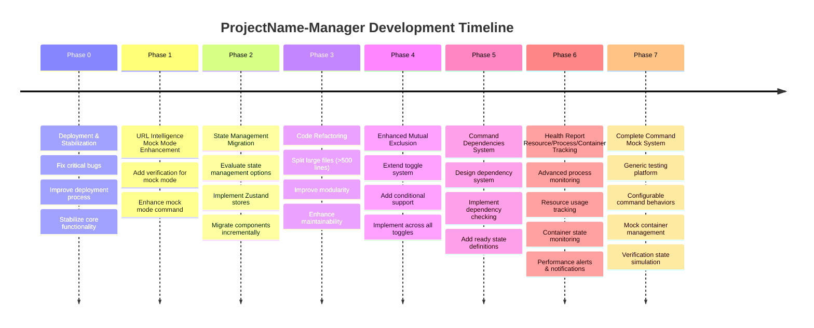

# ProjectName-Manager Development Roadmap

## Overview

This roadmap outlines the planned enhancements for ProjectName-Manager, focusing on improved functionality, better state management, and enhanced code maintainability.



## Phase 0: Deployment & Stabilization

### 0.1 Fix Critical Bugs
- **Priority**: Address any blocking issues preventing normal app operation
- **Focus areas**: Terminal management, configuration loading, IPC communication
- **Testing**: Ensure all existing functionality works reliably

### 0.2 Improve Deployment Process
- **Target**: Streamline build and distribution process
- **Enhancements**: 
  - Automated build pipeline
  - Cross-platform compatibility testing
  - Package app
- **Goal**: Make deployment consistent and reliable

### 0.3 Stabilize Core Functionality
- **Terminal operations**: Ensure PTY management is robust
- **Configuration management**: Validate config loading/saving reliability
- **Error handling**: Improve error boundaries and recovery mechanisms
- **Performance**: Address any memory leaks or performance bottlenecks


## Phase 1: URL Intelligence Mock Mode Enhancement

### Add Verification for URL Intelligence Mock Mode
- **Target**: `src/project-config/config/configurationSidebarAbout.json`
- **Add verification**: Check if `ThreatIntelligenceMock` directory exists
- **Add fix command**: `git clone <mock-repo-url> ./ThreatIntelligenceMock`
- **Files to modify**:
  - `configurationSidebarAbout.json` - add verification entry
  - Existing verification system handles the rest automatically

## Phase 2: State Management Migration

### 2.1 Evaluate State Management Options
- **Options**: Redux Toolkit, Zustand, Valtio
- **Recommendation**: Zustand (lightweight, TypeScript-friendly)
- **Decision factors**: Bundle size, learning curve, existing React patterns

### 2.2 Implementation Strategy
- **Current**: Multiple `useState` hooks across components
- **Target**: Centralized state stores
- **Priority order**:
  1. `useAppState.js` → Zustand store
  2. `useProjectConfig.js` → Configuration store  
  3. `useFloatingTerminals.js` → Terminal state store
  4. `useAutoSetup.js` → Auto-setup store

### 2.3 Migration Plan
- Create stores incrementally without breaking existing functionality
- Use adapters to bridge old and new state systems during transition
- Migrate components one by one, starting with leaf components

## Phase 3: Code Refactoring

### 3.1 Large Files to Split

**Priority 1 (>500 lines)**:
- `src/main-process/environmentVerification.js` (825 lines)
  - Split into: `verification-runners.js`, `verification-parsers.js`, `verification-config.js`
- `src/main-process/ptyManagement.js` (654 lines) 
  - Split into: `pty-spawning.js`, `process-monitoring.js`, `command-execution.js`
- `src/auto-setup/AutoSetupScreen.jsx` (565 lines)
  - Split into: `AutoSetupHeader.jsx`, `CommandGroupList.jsx`, `CommandItem.jsx`
- `src/project-config/ConfigSection.jsx` (517 lines)
  - Split into: `SectionHeader.jsx`, `SectionControls.jsx`, `SubSectionList.jsx`

**Priority 2 (300-500 lines)**:
- `src/health-report/HealthReportScreen.jsx` (474 lines)
- `src/App.jsx` (421 lines) - extract custom hooks
- `src/auto-setup/useAutoSetup.js` (420 lines) - split into multiple hooks

### 3.2 Modularity Improvements
- Create shared component library in `src/common/components/`
- Extract business logic into custom hooks
- Implement consistent error handling patterns
- Add proper TypeScript interfaces (if migrating to TS)

## Phase 4: Enhanced Mutual Exclusion

### 4.1 Extend Toggle System
- **Current**: Only `attachToggle` supports mutual exclusion
- **Target**: All toggle types (main toggle, mode selectors, deployment options)

### 4.2 Add Condition Support
```javascript
// Enhanced toggle configuration
{
  "toggle": true,
  "mutuallyExclusiveWith": [
    {
      "sectionId": "other-section",
      "condition": "mode === 'debug'", // only when other section is in debug mode
      "message": "Cannot enable while other-section is in debug mode"
    }
  ]
}
```

### 4.3 Implementation
- **Files to modify**:
  - `src/project-config/hooks/useProjectConfig.js` - extend toggle logic
  - `src/project-config/ConfigSection.jsx` - add condition evaluation
  - Configuration JSON files - add conditional exclusions

## Phase 5: Command Dependencies System

### 5.1 Design Dependency System
```javascript
// New command structure
{
  "id": "command-id",
  "dependencies": [
    {
      "commandId": "prerequisite-command",
      "readyWhen": "status === 'running'", // or custom condition
      "timeout": 30000 // optional timeout
    }
  ],
  "command": { /* existing command config */ }
}
```

### 5.2 Implementation
- **Files to modify**:
  - `src/common/utils/evalUtils.js` - extend command generation
  - `src/terminal/useTerminals.js` - add dependency checking
  - `src/project-config/config/configurationSidebarCommands.json` - add dependency definitions
- **New components**: 
  - Dependency status indicator
  - Command queue visualization

### 5.3 Ready State Definition
- **Terminal States**: `idle`, `starting`, `running`, `error`, `stopped`
- **Ready Conditions**: 
  - Process started (`running`)
  - Port listening (custom check)
  - Log pattern match (custom condition)
  - Container healthy (for container commands)

## Phase 6: Health Report Resource/Process/Container Tracking

### 6.1 Advanced Process Monitoring
- **Real-time Process Tree**: Complete process hierarchy visualization with parent-child relationships
- **Process State Tracking**: Monitor individual process states (running, sleeping, waiting, paused, finishing)
- **Resource Consumption**: Per-process CPU usage, memory consumption, and I/O statistics
- **Process Lifecycle Events**: Track process creation, termination, and state transitions

### 6.2 Container Resource Monitoring
- **Container Stats**: Real-time CPU, memory, disk I/O, and network usage per container
- **Container Health**: Monitor container health checks and status changes
- **Resource Limits**: Track against configured resource limits and quotas
- **Multi-Container Services**: Aggregate statistics for services with multiple containers

### 6.3 System Resource Tracking
- **CPU Monitoring**: System-wide CPU usage with per-core breakdown
- **Memory Usage**: RAM usage, swap usage, and available memory tracking
- **GPU Monitoring**: GPU utilization and memory usage (if available)
- **Disk I/O**: Read/write operations and disk space monitoring
- **Network Activity**: Network traffic monitoring for processes and containers

### 6.4 Performance Alerts & Notifications
- **Resource Thresholds**: Configurable alerts for high CPU, memory, or disk usage
- **Performance Degradation**: Detect and alert on performance issues
- **Resource Exhaustion**: Early warning for resource exhaustion scenarios
- **Custom Alerts**: User-defined alert conditions and notification preferences

### 6.5 Enhanced Health Report UI
- **Resource Dashboard**: Visual overview of system and process resource usage
- **Performance Graphs**: Historical resource usage charts and trends
- **Process Explorer**: Detailed process information with kill/restart capabilities
- **Container Management**: Container control and monitoring interface
- **Alert Center**: Centralized notification and alert management

### 6.6 Implementation Details
- **Files to modify**:
  - `src/health-report/HealthReportScreen.jsx` - add resource monitoring UI
  - `src/health-report/useHealthReport.js` - extend monitoring logic
  - `src/main-process/ptyManagement.js` - integrate process monitoring
  - `src/main-process/containerManagement.js` - add container resource tracking
- **New components**:
  - ResourceDashboard.jsx
  - ProcessExplorer.jsx
  - PerformanceChart.jsx
  - AlertCenter.jsx

## Phase 7: Complete Command Mock System

### 7.1 Generic Testing Platform
- **Mock Command Engine**: Configurable command execution simulator independent of real projects
- **Behavior Scripting**: Define command behaviors (success, failure, sleep, multi-stage execution) with time-based progression
- **Universal Configuration**: Works across `configurationSidebarCommands.json`, `fixCommand` entries, and verification commands
- **Stage-Based Execution**: Commands can simulate complex workflows with configurable timing and outcomes

### 7.2 Mock Container Management
- **Dummy Container System**: Launch real containers with mock services for testing
- **Container Lifecycle Simulation**: Containers that start, stop, restart, and fail on command
- **Associated Container Testing**: Test container management features without real services
- **Resource Usage Simulation**: Mock containers that consume configurable CPU/memory for testing monitoring

### 7.3 Verification State Simulation
- **Initial State Configuration**: Set starting verification states (valid/invalid/unknown)
- **Fix Command Results**: Configure what each fix command execution will result in (success/failure/partial)
- **Dynamic State Changes**: Simulate verification state changes over time
- **Dependency Chain Testing**: Test verification dependencies and cascading effects

### 7.4 Configurable Test Scenarios
- **Test Profiles**: Pre-defined testing scenarios (all pass, all fail, mixed states, slow commands)
- **Time-Based Staging**: Commands that transition through multiple states over configurable time periods
- **Failure Simulation**: Commands that fail after specific durations or conditions
- **Recovery Testing**: Test auto-retry mechanisms and error handling

### 7.5 Implementation
- **Files to modify**:
  - `src/main-process/ptyManagement.js` - add mock execution mode
  - `src/main-process/environmentVerification.js` - add verification state simulation
  - `src/main-process/containerManagement.js` - mock container integration
- **New files**:
  - `mock-commands-config.json` - mock command behavior definitions
  - `mock-scenarios.json` - pre-defined test scenarios
  - `mockExecutionEngine.js` - mock command execution system
- **Configuration additions**: Mock mode toggles in existing JSON configuration files

## Success Metrics

1. **URL Intelligence**: Mock mode has proper verification and auto-fix
2. **State Management**: Reduced prop drilling, centralized state updates
3. **Code Quality**: No files >400 lines, improved test coverage, better maintainability
4. **Toggles**: Conditional mutual exclusion working across all toggle types
5. **Dependencies**: Commands wait for prerequisites, clear visual feedback
6. **Resource Monitoring**: Comprehensive tracking with proactive alerts
7. **Mock Testing System**: Complete testing platform independent of real projects

## Implementation Notes

This roadmap prioritizes user-facing features first (URL Intelligence, state management migration) while building toward better maintainability through code refactoring. The enhanced mutual exclusion and command dependencies provide better configuration control, while the comprehensive resource monitoring in Phase 6 transforms the health report into a powerful system monitoring tool. Each phase builds upon the previous ones, ensuring a stable development progression. 