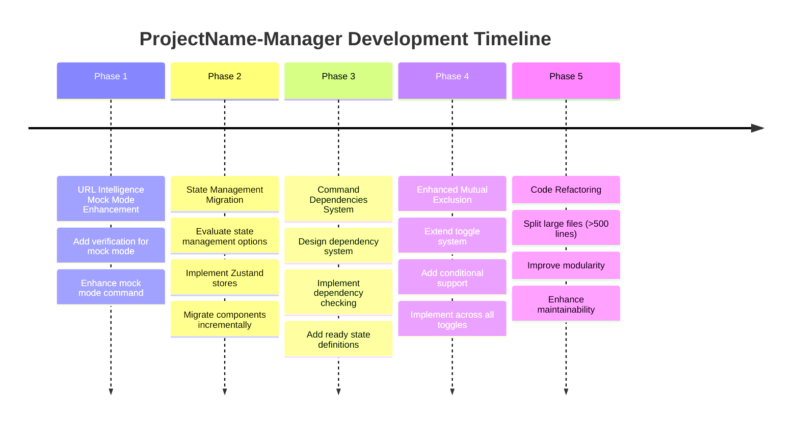

# ProjectName-Manager Development Roadmap

## Overview

This roadmap outlines the planned enhancements for ProjectName-Manager, focusing on improved functionality, better state management, and enhanced code maintainability.



## Phase 1: URL Intelligence Mock Mode Enhancement

### 1.1 Add Verification for URL Intelligence Mock Mode
- **Target**: `src/project-config/config/configurationSidebarAbout.json`
- **Add verification**: Check if `ThreatIntelligenceMock` directory exists
- **Add fix command**: `git clone <mock-repo-url> ./ThreatIntelligenceMock`
- **Files to modify**:
  - `configurationSidebarAbout.json` - add verification entry
  - Existing verification system handles the rest automatically

### 1.2 Enhance Mock Mode Command
- **Target**: `src/project-config/config/configurationSidebarCommands.json` 
- **Current**: Mock mode command exists but needs verification integration
- **Enhancement**: Add pre-command validation to ensure mock directory exists

## Phase 2: State Management Migration

### 2.1 Evaluate State Management Options
- **Options**: Redux Toolkit, Zustand, Valtio
- **Recommendation**: Zustand (lightweight, TypeScript-friendly)
- **Decision factors**: Bundle size, learning curve, existing React patterns

### 2.2 Implementation Strategy
- **Current**: Multiple `useState` hooks across components
- **Target**: Centralized state stores
- **Priority order**:
  1. `useAppState.js` → Zustand store
  2. `useProjectConfig.js` → Configuration store  
  3. `useFloatingTerminals.js` → Terminal state store
  4. `useAutoSetup.js` → Auto-setup store

### 2.3 Migration Plan
- Create stores incrementally without breaking existing functionality
- Use adapters to bridge old and new state systems during transition
- Migrate components one by one, starting with leaf components

## Phase 3: Command Dependencies System

### 3.1 Design Dependency System
```javascript
// New command structure
{
  "id": "command-id",
  "dependencies": [
    {
      "commandId": "prerequisite-command",
      "readyWhen": "status === 'running'", // or custom condition
      "timeout": 30000 // optional timeout
    }
  ],
  "command": { /* existing command config */ }
}
```

### 3.2 Implementation
- **Files to modify**:
  - `src/common/utils/evalUtils.js` - extend command generation
  - `src/terminal/useTerminals.js` - add dependency checking
  - `src/project-config/config/configurationSidebarCommands.json` - add dependency definitions
- **New components**: 
  - Dependency status indicator
  - Command queue visualization

### 3.3 Ready State Definition
- **Terminal States**: `idle`, `starting`, `running`, `error`, `stopped`
- **Ready Conditions**: 
  - Process started (`running`)
  - Port listening (custom check)
  - Log pattern match (custom condition)
  - Container healthy (for container commands)

## Phase 4: Enhanced Mutual Exclusion

### 4.1 Extend Toggle System
- **Current**: Only `attachToggle` supports mutual exclusion
- **Target**: All toggle types (main toggle, mode selectors, deployment options)

### 4.2 Add Condition Support
```javascript
// Enhanced toggle configuration
{
  "toggle": true,
  "mutuallyExclusiveWith": [
    {
      "sectionId": "other-section",
      "condition": "mode === 'debug'", // only when other section is in debug mode
      "message": "Cannot enable while other-section is in debug mode"
    }
  ]
}
```

### 4.3 Implementation
- **Files to modify**:
  - `src/project-config/hooks/useProjectConfig.js` - extend toggle logic
  - `src/project-config/ConfigSection.jsx` - add condition evaluation
  - Configuration JSON files - add conditional exclusions

## Phase 5: Code Refactoring

### 5.1 Large Files to Split

**Priority 1 (>500 lines)**:
- `src/main-process/environmentVerification.js` (825 lines)
  - Split into: `verification-runners.js`, `verification-parsers.js`, `verification-config.js`
- `src/main-process/ptyManagement.js` (654 lines) 
  - Split into: `pty-spawning.js`, `process-monitoring.js`, `command-execution.js`
- `src/auto-setup/AutoSetupScreen.jsx` (565 lines)
  - Split into: `AutoSetupHeader.jsx`, `CommandGroupList.jsx`, `CommandItem.jsx`
- `src/project-config/ConfigSection.jsx` (517 lines)
  - Split into: `SectionHeader.jsx`, `SectionControls.jsx`, `SubSectionList.jsx`

**Priority 2 (300-500 lines)**:
- `src/health-report/HealthReportScreen.jsx` (474 lines)
- `src/App.jsx` (421 lines) - extract custom hooks
- `src/auto-setup/useAutoSetup.js` (420 lines) - split into multiple hooks

### 5.2 Modularity Improvements
- Create shared component library in `src/common/components/`
- Extract business logic into custom hooks
- Implement consistent error handling patterns
- Add proper TypeScript interfaces (if migrating to TS)

## Success Metrics

1. **URL Intelligence**: Mock mode has proper verification and auto-fix
2. **State Management**: Reduced prop drilling, centralized state updates
3. **Dependencies**: Commands wait for prerequisites, clear visual feedback
4. **Toggles**: Conditional mutual exclusion working across all toggle types
5. **Code Quality**: No files >400 lines, improved test coverage, better maintainability

## Implementation Notes

This roadmap prioritizes user-facing features first (URL Intelligence, command dependencies) while building toward better maintainability through state management migration and code refactoring. Each phase builds upon the previous ones, ensuring a stable development progression. 